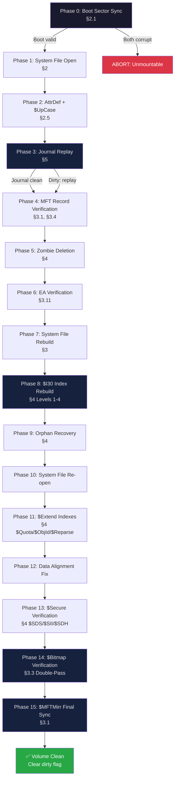

# NTFS Repair RFC — Clean Room Algorithmic Specification

> **A legally defensible, industry-grade blueprint for building an open-source NTFS structural repair engine from scratch.**

[](https://creativecommons.org/publicdomain/zero/1.0/)
[]()
[]()

---

## The Problem

The open-source ecosystem has **no real NTFS repair tool**.

Every Linux distribution ships with `ntfsfix` (from ntfs-3g) and `ntfsprogs`, but these utilities are fundamentally limited to superficial flag-clearing operations. They **cannot** perform the deep structural repairs that Windows `chkdsk` handles routinely:

| Corruption Scenario | What Happens Today (Linux) |
| :--- | :--- |
| MFT record with failed USA checksum | `ntfsfix`: clears dirty flag, hopes for the best |
| Directory B-Tree ($I30) with broken sort order | No tool can fix this — files become invisible |
| $Bitmap says cluster is free, but a file uses it | No detection — silent data overwrite on next write |
| $ATTRIBUTE_LIST with circular references | Tool hangs or crashes |
| $MFTMirr diverged from primary $MFT | `ntfsfix`: copies primary over mirror blindly (may propagate corruption) |
| $LogFile contains uncommitted transactions | No tool replays the journal |
| Orphaned files (valid data, no directory entry) | Files are permanently lost |
| Extended Attributes ($EA) chain corruption | No tool detects this |
| Security Descriptors ($SDS/$SII) inconsistency | No tool validates or rebuilds these |

**The result:** users with corrupted NTFS volumes on Linux are told to "boot into Windows and run `chkdsk`" — a solution that is impractical for headless servers, embedded systems, dual-boot recovery scenarios, and environments where Windows is simply not available.

This RFC aims to provide the technical foundation to help change that.

---

## What This Repository Contains

This is a **specification-only repository**. It contains no executable code. It provides everything a developer needs to implement a complete NTFS repair engine without ever touching proprietary code.

| Document | Purpose |
| :--- | :--- |
| [`ntfs-repair_clean_room_spec.md`](ntfs-repair_clean_room_spec.md) | **Main RFC** — 1400+ lines covering the complete 16-phase repair pipeline, all NTFS structures, repair policies, binary format schemas, API contracts, and 11 implementation pitfalls |
| [`ntfs-repair_pseudocode_reference.md`](ntfs-repair_pseudocode_reference.md) | **Pseudo-code companion** — Implementable algorithms for every critical phase: Boot Sector sync, Data Run decoding, USA fixup, Bitmap double-pass, B-Tree rebuild, Journal replay, orphan recovery, WAL crash recovery |
| [`ntfs-repair-rfc_legal_statement.md`](ntfs-repair-rfc_legal_statement.md) | **Legal declaration** — Formal clean room certification documenting the information barrier |
| [`CONTRIBUTING_CLEAN_ROOM.md`](CONTRIBUTING_CLEAN_ROOM.md) | **Contribution rules** — Requirements for contributors to maintain legal cleanliness |
| [`README.md`](README.md) | This file |

---

## Clean Room Philosophy

This specification was developed under a strict **Clean Room** methodology to ensure it is legally defensible and free from any proprietary contamination.

### What "Clean Room" Means

```
┌─────────────────────────────────────────────────────────────┐
│                    INFORMATION BARRIER                      │
│                                                             │
│  ✅ ALLOWED SOURCES              ❌ FORBIDDEN SOURCES       │
│  ─────────────────               ────────────────────       │
│  • [MS-NTFS] public spec         • Windows source code      │
│  • MSDN / Microsoft Learn        • chkdsk.exe disassembly   │
│  • ntfs.com documentation        • NTFS.sys decompilation   │
│  • Academic papers               • Leaked code / NDA docs   │
│  • Black-box I/O observation     • Proprietary headers      │
│  • Controlled corruption tests   • Internal Microsoft docs  │
│  • Public WDK headers (ntifs.h)  • Third-party NDA tools    │
│                                                             │
└─────────────────────────────────────────────────────────────┘
```

### Author's Declaration of Absolute Air Gap

I, **seb3773** (author of this specification), hereby formally declare and affirm on my honor that to ensure absolute compliance with the Clean Room concept:
1. I will **never** write, contribute to, or review any source code for an NTFS repair utility based on these specifications.
2. I will **never** provide, share, or publish the raw analysis elements, memory dumps, strace logs, or behavioral observations that allowed me to write this specification to any developer, under any circumstances.

This guarantees a total and absolute "air gap" (Chinese wall) between the knowledge I possess from my analysis and the developers who will ultimately produce the code from these specifications.

### Behavioral Observation Methodology

All behavioral insights documented in this specification were obtained through **black-box testing only**:

1. **Controlled corruption injection** — Specific NTFS structures were surgically corrupted on test images (using hex editors and custom scripts), then repaired by proprietary tools, and the resulting disk changes were observed at the byte level.
2. **System call tracing** (`strace`) — I/O patterns, `read()`/`write()` sequences, and `ioctl()` calls were recorded to understand repair ordering and phase dependencies.
3. **Disk diffing** — Binary diffs of NTFS images before and after repair to identify exactly which sectors were modified and what the new values represent.

No proprietary binary was disassembled, decompiled, or reverse-engineered. See [`ntfs-repair-rfc_legal_statement.md`](ntfs-repair-rfc_legal_statement.md) for the formal declaration.

---

## Feature Comparison

### vs. Existing Open-Source Tools

| Feature | This RFC | `chkdsk` (Windows) | `ntfsfix` (ntfs-3g) | `ntfsprogs` (Linux) |
| :--- | :---: | :---: | :---: | :---: |
| **Boot Sector Bidirectional Sync** | ✅ | ✅ | ❌ | ❌ |
| **Journal Replay ($LogFile)** | ✅ Semi-semantic | ✅ Full opcode | ❌ | ❌ |
| **MFT Repair (USA + CRC32 + Mirror)** | ✅ | ✅ | ⚠️ Partial | ❌ |
| **Bitmap Double-Pass Ground Truth** | ✅ | ✅ | ❌ | ❌ |
| **B-Tree / $I30 4-Level Rebuild** | ✅ | ✅ | ❌ | ❌ |
| **$ATTRIBUTE_LIST Rebuild** | ✅ | ✅ | ❌ | ❌ |
| **DOS 8.3 Name Regeneration** | ✅ | ✅ | ❌ | ❌ |
| **Orphan Recovery to `found.000/`** | ✅ | ✅ | ⚠️ Basic | ❌ |
| **$Secure / $SDS / $SII Validation** | ✅ | ✅ | ❌ | ❌ |
| **$Quota / $ObjId Index Validation** | ✅ | ✅ | ❌ | ❌ |
| **Reparse Point Payload Validation** | ✅ | ✅ | ❌ | ❌ |
| **Extended Attributes ($EA) Chain** | ✅ | ✅ | ❌ | ❌ |
| **EFS Header Structural Validation** | ✅ Optional | ✅ | ❌ | ❌ |
| **Bad Sector Relocation ($BadClus)** | ✅ | ✅ | ❌ | ❌ |
| **Crash-Safety (WAL / COW)** | ✅ | ✅ (via NTFS Log) | ❌ | ❌ |
| **Scan / Dry-Run / Apply Modes** | ✅ | ✅ (`/scan`) | ✅ (read-only) | ✅ (read-only) |
| **4KB MFT Record Support** | ✅ | ✅ | ❌ | ❌ |
| **NTFS 1.2 / 3.0 / 3.1 Compat** | ✅ | ✅ | ⚠️ 3.1 only | ⚠️ 3.1 only |

### This RFC's Unique Additions (vs. `chkdsk`)

| Feature | `chkdsk` | This RFC | Why It Matters |
| :--- | :---: | :---: | :--- |
| **Semantic Validation Barrier for $MFTMirr** | ❌ Header-only | ✅ Full attribute validation | Prevents propagating silent bit-rot to the mirror |
| **Anti-Zombie Protection** | ❌ Deletes files without `$DATA` | ✅ Preserves `$INDEX_ROOT`, `$EA`, `$LOGGED_UTILITY_STREAM` | Prevents deletion of valid empty directories and EFS files |
| **Orphan INDX Page Recovery (Level 4)** | ❌ Not documented | ✅ Sequential sweep with pseudo-code | Recovers filenames from detached index pages |
| **Data Deduplication Stub Awareness** | ❌ Not documented | ✅ Explicit handling | Prevents false-positive corruption on dedup stubs |
| **TRIM Prohibition During Repair** | ❌ Not documented | ✅ Mandatory policy | Prevents irreversible data destruction on SSDs |
| **Recursive Stack Overflow Protection** | ❌ Confirmed vulnerable | ✅ Mandatory iterative traversal | Prevents `SIGSEGV` crash on adversarial images |

---

## The 16-Phase Repair Pipeline

The engine processes an NTFS volume through a strict, **dependency-ordered** sequence of 16 phases. Each phase builds on the results of the previous one. No phase may be skipped or reordered.



### Phase Summary

| Phase | Name | Risk Level | Pre-Write Check |
| :---: | :--- | :---: | :---: |
| 0 | **Boot Sector Validation** | **HIGH** | ✅ Yes |
| 1 | **System File Open** ($MFT, $MFTMirr, $Bitmap, $LogFile) | **HIGH** | ✅ Yes |
| 2 | **AttrDef & $UpCase Loading** | Medium | ✅ Yes |
| 3 | **Journal Replay** ($LogFile) | **HIGH** | ✅ Yes |
| 4 | **MFT Record Verification** | **HIGH** | ✅ Yes |
| 5 | **Zombie Deletion** (Empty records) | Medium | ❌ No |
| 6 | **Extended Attributes (EA) Verification** | Low | ❌ No |
| 7 | **System File Creation/Repair** | Medium | ❌ No |
| 8 | **Folder ($I30) Index Verification** | **HIGH** | ❌ No |
| 9 | **Orphan Recovery** (to lost+found) | Medium | ❌ No |
| 10 | **System File Re-open** | Low | ❌ No |
| 11 | **$Extend Indexes Verification** | Low | ❌ No |
| 12 | **Data Alignment Fix** | Low | ❌ No |
| 13 | **Security ($Secure) Verification** | Medium | ❌ No |
| 14 | **$Bitmap Verification** | **HIGH** | ❌ No |
| 15 | **$MFTMirr Correction** | **HIGH** | ❌ No |

---

## Core Design Principles

### 1. Deletion Over Dubious Repair

When a structure is corrupt beyond reliable reconstruction, the engine **deletes it** rather than attempting a heuristic repair that could introduce silent data corruption.

> *Example: A corrupt `$EA` chain is deleted entirely (both `$EA` and `$EA_INFORMATION`), rather than truncated at the last valid entry — because a truncated chain leaves `$EA_INFORMATION.EaCount` inconsistent, causing Windows to crash with `INCONSISTENCY_ERROR` on file access.*

### 2. Conservative, Deterministic Behavior

- No heuristics or probabilistic reconstruction
- No attribute migration between records
- No speculative data recovery
- Same input → same output, always

### 3. Crash-Safety via WAL

Every disk write in `--apply` mode goes through a **Write-Ahead Log** (WAL) with CRC32 verification. A power loss at any point during repair can be recovered on the next startup — either by rolling forward pending writes or detecting external modification.

### 4. Five Operational Modes

| Mode | Flag | Reads Disk | Modifies Disk | Description |
| :--- | :--- | :---: | :---: | :--- |
| **Scan** | `--scan` | ✅ | ❌ | Read-only structural validation. |
| **Dry-Run** | `--dry-run` | ✅ | ❌ | Full pipeline using in-memory Shadow Buffers. |
| **Minimal (MVR)** | `--mvr` | ✅ | ✅ | Executes safe core phases (0-4, 14-15) to clear dirty flag. |
| **Repair** | `--apply` | ✅ | ✅ | Full 16-phase pipeline with WAL. |
| **Salvage** | `--salvage-aggressive` | ✅ | ✅ | ⚠️ Ignores fatal checks to carve out files (High Risk). |

### 5. No TRIM During Repair

Freeing clusters in the `$Bitmap` is a metadata-level operation only. The engine **never** issues `TRIM`/`DISCARD` commands to the underlying block device, because a wrong bitmap diagnosis + TRIM = **permanent, unrecoverable data destruction** on SSDs.

---

## NTFS Compatibility Matrix

### Version Support

| NTFS Version | Windows | MFT CRC32 | Supported | Key Differences |
| :--- | :--- | :---: | :---: | :--- |
| **1.2** | NT 4.0 | ❌ | ✅ | CRC32 validation auto-disabled; `$UsnJrnl` absent |
| **3.0** | Windows 2000 | ❌ | ✅ | `$UsnJrnl` may be disabled |
| **3.1** | XP through Win11 | ✅ | ✅ | Primary target — full feature set |

### Volume Geometry

| Parameter | Supported Range | Notes |
| :--- | :--- | :--- |
| Cluster Size | 512 B – 2 MB | Parsed from Boot Sector |
| MFT Record Size | 1024 B, 4096 B | Dynamic via signed-byte encoding at offset `0x40` |
| INDX Page Size | 4096 B (standard) | Dynamic via offset `0x44` |
| Volume Size | Up to 256 TB | 64-bit LCN arithmetic |
| Physical Sector | 512 B, 4096 B (4Kn) | Auto-detected via `BLKPBSZGET` |

### Feature Support

| Feature | Support Level | Notes |
| :--- | :---: | :--- |
| MFT / MFTMirr | ✅ Full | Semantic Validation Barrier |
| Data Runs / Sparse / Compressed | ✅ Full | LZNT1 detection + sparse-fill |
| B-Tree / $I30 | ✅ Full | 4-level rebuild with pseudo-code |
| $Bitmap | ✅ Full | Double-pass Ground Truth |
| Journal ($LogFile) | ✅ Full | Semi-semantic redo replay |
| Security ($Secure) | ✅ Full | $SDS + $SII + $SDH cross-validation |
| Extended Attributes ($EA) | ✅ Full | 5-rule chain validation |
| Reparse Points | ✅ Full | Mount Point + Symlink payload validation |
| Quotas / Object IDs | ✅ Full | Index key/value structure defined |
| $UsnJrnl | ⚠️ Advisory | Filename hints only — never structural |
| EFS (Encryption) | ⚠️ Header only | Opaque payload; structural header validation |
| TxF (Transactional) | ⚠️ Pass-through | Deprecated since Win8; no explicit handling |
| Data Deduplication | ⚠️ Preserve | Stub preserved; chunk store not validated |
| VSS / Shadow Copies | ❌ Excluded | Invalidated after repair — documented |
| BitLocker / FVE | ❌ Excluded | Volume must be unlocked first |

---

## Safety & Security

### 11 Implementation Pitfalls

The specification includes a catalogue of **11 concrete, well-documented implementation pitfalls** — each with a problem description, a code example (where applicable), and the mandated fix:

| # | Pitfall | Risk | Key Fix |
| :---: | :--- | :--- | :--- |
| 1 | Integer overflow in LCN/VCN arithmetic | Silent disk corruption | `__builtin_mul_overflow` on all cluster math |
| 2 | Race conditions on shared Bitmap | Spurious cross-link detection | Thread-local Roaring Bitmaps + merge |
| 3 | Endianness | Byte-swapped values on big-endian hosts | `le16toh()`/`le64toh()` everywhere |
| 4 | Sign extension in Data Run delta | Corrupted 64-bit offsets | `(int64_t)(int8_t)` cast before shift |
| 5 | O_DIRECT alignment | `EINVAL` or misaligned writes | `posix_memalign()` to physical sector size |
| 6 | Unicode collation trap | B-Tree silently wrong, files invisible | Use volume's own `$UpCase` table (version-dependent!) |
| 7 | Allocate-before-free cluster reuse | Cross-link after crash | Mark Bad → Free → Flush → Allocate sequence |
| 8 | ECC/RAID transparent error masking | Bad sectors never detected | `O_DIRECT` + `BLKFLSBUF` to bypass host FS |
| 9 | TRIM during repair | **Permanent data destruction** on SSDs | Never issue TRIM — metadata-only corrections |
| 10 | Recursive tree walkers | Stack overflow crash (~25K records) | **Mandatory iterative traversal** (confirmed vuln) |
| 11 | Disk writes without WAL | Irrecoverable partial repairs | All writes via WAL with CRC32 verification |

### Adversarial Input Resistance

The specification mandates:
- **AFL++ fuzzing** with 3 dedicated harnesses (Data Run parser, INDX node parser, MFT record parser)
- **ASan + UBSan** on all test builds
- **Adversarial image corpus** (circular B-Trees, contradictory MFT/MFTMirr, oversized USAs)
- **`seccomp-bpf`** syscall whitelist in production
- **Phase-based 5-minute watchdog** timeout
- **OCI container** isolation for CI testing

### Automated Test Corpus (`test-corpus/`)

This project includes an automated suite for generating deterministic NTFS corruption images (`generate_test_corpus.sh`) and its associated reference documentation (`test_corpus_reference.md`). This ensures that developers can continuously test their implementations against the exact edge-cases described in the RFC without risking live data.

---

## Binary Format Reference

The specification includes **7 annotated hex schemas** for parser validation:

| Schema | Structure | Key Fields |
| :--- | :--- | :--- |
| D.1 | NTFS Boot Sector | OEM ID, BPB, `clusters_per_mft_record`, `0x55AA` |
| D.2 | MFT Record Header | `FILE` magic, USA offset/count, flags, used/allocated size |
| D.3 | Data Run Encoding | 3 annotated examples (contiguous, sparse, negative delta) |
| D.4 | INDX Record Header | `INDX` magic, VCN, index entry format |
| D.5 | $LogFile RCRD Page | Page header + LFS Log Record + NTFS Client Data (redo/undo) |
| D.6 | USN_RECORD_V2 | Full binary layout with validation rules |
| D.7 | EFS_ATTR_HEADER | DDF/DRF offsets, version, validation constraints |

---

## Technical Infrastructure

### I/O Abstraction (`io_context`)

A formal C VTable contract is specified with:
- `read()` / `write()` / `sync()` operations
- Physical sector alignment enforcement
- **3-tier error classification**: Transient (retry with backoff) → Recoverable (bad sector, continue) → Fatal (abort)
- Short read = fatal error (no stitching)
- 30-second I/O timeout for dying hardware
- Mock adapter for deterministic unit testing

### Write-Ahead Log (WAL)

Binary format fully specified:
- 0x20-byte header + variable payload + self-CRC32
- Recovery algorithm with roll-forward / already-applied / conflict detection
- Integrated with the 3 operational modes (scan / dry-run / apply)

### Structured Logging

- JSON-Lines format with 22 normalized error codes (`E_USA_MISMATCH`, `E_BITMAP_CROSSLINK`, `E_IO_TIMEOUT`, etc.)
- 5 log levels: `TRACE`, `INFO`, `WARN`, `ERROR`, `FATAL`
- Machine-parseable for CI regression tracking

### Large Volume Support (>10 TB)

- Memory dimensioning table (1 TB → 64 TB)
- Roaring Bitmap compressed data structures
- Parallel Map/Shard/Reduce merge algorithm
- Peak memory: ~576 MB for a 16 TB volume with 8 threads

---

## Windows Interoperability

### `chkdsk` Round-Trip Guarantee

After a successful `--apply` repair, running `chkdsk X: /scan` on Windows **MUST** report:

```
Windows has scanned the file system and found no problems.
No further action is required.
```

Any error constitutes a **release-blocking bug**. An automated CI script (QEMU + WinRM) is provided for this validation.

### Documented Side Effects

Users are warned before `--apply` that:

| Effect | Reversible? |
| :--- | :---: |
| Shadow Copies / Previous Versions lost | ❌ No |
| EFS-encrypted files with corrupt keys become undecryptable | ❌ No |
| Dedup stubs with corrupt reparse become unresolvable | ❌ No |
| Symlinks / Junctions may become regular files | ⚠️ Manual |
| `$UsnJrnl` may be reset | ✅ Auto-rebuild |
| Orphaned files appear in `found.000/` | ✅ User sorts |

---

## Normative References

All structural definitions in this specification are derived exclusively from public sources:

| Ref | Title |
| :--- | :--- |
| [MS-NTFS] | [Windows NT File System Technical Reference](https://docs.microsoft.com/en-us/openspecs/windows_protocols/ms-ntfs/) |
| [MSDN-REPARSE] | [Reparse Point Tags — ntifs.h](https://learn.microsoft.com/en-us/windows-hardware/drivers/ddi/ntifs/ns-ntifs-_reparse_data_buffer) |
| [MSDN-EA] | [`FILE_FULL_EA_INFORMATION` — ntifs.h](https://learn.microsoft.com/en-us/windows-hardware/drivers/ddi/ntifs/ns-ntifs-_file_full_ea_information) |
| [MSDN-USN] | [`USN_RECORD_V2` — winioctl.h](https://learn.microsoft.com/en-us/windows/win32/api/winioctl/ns-winioctl-usn_record_v2) |
| [NTFS-COM] | [NTFS Documentation (community)](https://www.ntfs.com/ntfs-system-files.htm) |
| [LZNT1] | [LZNT1 Compression — MS-DRSR §4.1.4](https://docs.microsoft.com/en-us/openspecs/windows_protocols/ms-drsr/) |
| [ROARING] | [Roaring Bitmaps — Chambi et al., 2016](https://arxiv.org/abs/1402.6407) |
| [AFL++] | [AFL++ Fuzzing Framework](https://aflplus.plus/) |

---

## Contributing

> **⚠️ CRITICAL: Clean Room Requirement**

All contributors **must** certify that they have **never** accessed, read, disassembled, decompiled, or reverse-engineered any proprietary NTFS repair implementation — including but not limited to `chkdsk.exe`, `NTFS.sys`, `autochk.exe`, or any Paragon/Tuxera proprietary tool source code.

Implementations derived from this specification must be based solely on:
1. This RFC and its companion pseudo-code
2. Public Microsoft specifications ([MS-NTFS], MSDN)
3. General programming knowledge

See [`CONTRIBUTING_CLEAN_ROOM.md`](CONTRIBUTING_CLEAN_ROOM.md) for the full contributor requirements and the Developer Certificate of Origin.

---

## Known Research Gaps

The specification is comprehensive but acknowledges remaining areas where further research would be beneficial for a v2.0:

| Area | Status | Impact |
| :--- | :---: | :--- |
| Journal specialized opcodes (`0x0A`, `0x17`–`0x1C`) | Documented, deferred to v2.0 | ~15% of redo dispatch cases skipped in v1.0 |
| TxF in-flight transactions | Pass-through only | TxF deprecated since Win8; negligible real-world impact |
| EFS DDF/DRF deep validation | Header-only in v1.0 | Key material validation requires further research |
| HSM-managed Reparse Points | Preserved opaquely | Complex vendor-specific tags not validated |
| $LogFile multi-page records | Documented, flag `0x01` | Records spanning RCRD pages need boundary handling |

---

## Goal

> **Enable the open-source community to build a legally clean, fully open-source, deterministic, and safe NTFS structural repair utility for Linux and cross-platform environments.**

This specification is the foundation. The code is yours to write.

---

*This repository and all its documents are released under [CC0 1.0 Universal](https://creativecommons.org/publicdomain/zero/1.0/) — Public Domain Dedication.*
