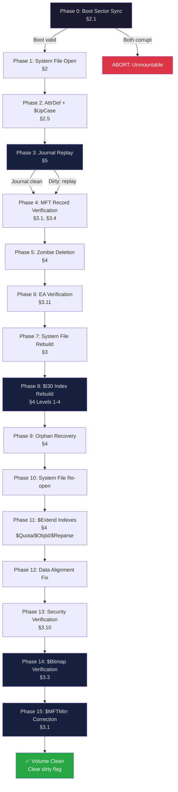

# RFC: Advanced NTFS File System Repair Algorithmic Specification

**Version:** 1.0 (Draft)
**Status:** Clean Room Specification
**License:** Public Domain / Open Source
**Target Audience:** C/C++ Systems Programmers, Filesystem Driver Developers (e.g., ReactOS, ntfs-3g)

---

> [!IMPORTANT]  
> **LEGAL DISCLAIMER & CLEAN ROOM NOTICE**
> 
> This document is a **Functional Specification** created via the "Clean Room" (or Chinese Wall) reverse engineering methodology. 
> 
> 1. It has been generated entirely through black-box provocation testing, runtime behavior observation (strace, I/O monitoring), and architectural abstraction of proprietary NTFS repair utilities.
> 2. It contains **NO assembly instructions, NO binary offsets, NO memory addresses, and NO decompiled source code** from any closed-source software.
> 3. It is designed to be legally safely consumed by developers who have **never** interacted with or disassembled the original closed-source utilities, in order to create a compatible, open-source reimplementation.

---

## 1. Introduction & Architecture

This specification outlines the architecture and algorithms required to build an enterprise-grade NTFS filesystem check and repair utility. Unlike rudimentary tools that merely clear dirty flags, this specification details a true "Check Engine" capable of rebuilding B-Trees, parsing Data Runs, and handling complex MFT corruption.

#### 1.1 Scope: Repair vs. Recovery
It is critical to distinguish between **Repair (fsck)** and **Data Recovery (carving)**.
- **Repair (This Specification):** The goal is to restore the mathematical and structural consistency of the NTFS volume so it can be safely mounted read-write by the host OS. If an index cannot be perfectly rebuilt, it is deleted to preserve the integrity of the surviving B-Tree.
- **Recovery (Out of Scope):** Opportunistic data extraction (e.g., scraping disk sectors for JPEGs or piecing together broken MFT records to save a single file).

If a structure cannot be cleanly repaired, it is not the engine's job to perform heroics; the engine will drop the structure to save the filesystem. **A filesystem repair engine is not expected to maximize data recovery, but to restore structural integrity. These goals are often in conflict.** Users needing data extraction from a fundamentally broken drive should use tools like TestDisk or PhotoRec *before* attempting structural repair.

### 1.2 Design Principles vs Observed Behavior
This document is a Request for Comments (RFC) for a *new* engine. It is not a strict transcription of the native NTFS standard, nor is it a clone of `chkdsk` behavior. Throughout this specification, rules are marked to clarify their origin:
- **[NTFS STANDARD]:** A hard mathematical requirement of the NTFS format. Violating this guarantees an unmountable disk.
- **[OBSERVED BEHAVIOR]:** How Windows or `chkdsk` empirically behaves (often undocumented).
- **[DESIGN CHOICE]:** A deliberate engineering decision made by this specification. We explicitly choose safety, determinism, and predictability over Microsoft's undocumented heuristics.

* **Observed `chkdsk` Behavior:** `chkdsk` may sometimes attempt partial recovery, use heuristics to guess missing pointers, or leave inconsistent states in an attempt to save user data.
* **This Engine's Philosophy (Strict Determinism):** We prioritize absolute volume consistency over data salvage. Guessing introduces silent corruption.

When facing ambiguous corruption, implementers must adhere to the following rules:
1. **[DESIGN CHOICE] No Risky Heuristics:** The engine MUST NOT attempt to guess, probabilistically reconstruct, or pattern-match missing data (e.g., Update Sequence Arrays).
2. **[DESIGN CHOICE] No Data Migration:** The engine MUST NOT attempt complex, interruptible optimizations like migrating attributes between Resident and Non-Resident states.
3. **[DESIGN CHOICE] Deletion Over Dubious Repair:** If an attribute or index structure is fundamentally corrupted and cannot be rebuilt from a guaranteed ground truth, the engine MUST delete the structure and fall back to Orphan Recovery rather than attempting a partial or blind patch. A missing file is preferable to a cross-linked cluster chain that overwrites another file later.
4. **[NTFS STANDARD] Endianness Ambiguity:** The NTFS format is strictly Little-Endian. All multi-byte structures MUST be parsed as Little-Endian regardless of the host architecture. Implementers compiling for Big-Endian systems MUST use byte-swapping macros (e.g., `le32_to_cpu`) to avoid instantaneous volume corruption.

### 1.3 Main Engine Object & State Management
The orchestrator must maintain a centralized State Object (Context) throughout execution. This object isolates I/O from the business logic.
- **State & Phases:** Must track the current Verification Phase, error accumulation status, and volume metadata (cluster size, MFT record size).
- **I/O Abstraction:** All raw disk access must be delegated to an isolated I/O sub-object (`io_context`) which exclusively handles physical `seek` and `read/write` operations based on calculated physical byte offsets.

### 1.4 Verification Orchestrator (16-Step Pipeline)
The main verification loop must run in distinct phases to safely rebuild the volume. This strict ordering prevents secondary corruption:
| Phase | Name | Risk Level | Pre-Write Check |
| :---: | :--- | :--- | :---: |
| 0 | **Boot Sector Validation** | **HIGH** | ✅ Yes |
| 1 | **System File Open** ($MFT, $MFTMirr, $Bitmap, $LogFile) | **HIGH** | ✅ Yes |
| 2 | **AttrDef & $UpCase Loading** | Medium | ✅ Yes |
| 3 | **Journal Replay** ($LogFile) | **HIGH** | ✅ Yes |
| 4 | **MFT Record Verification** | **HIGH** | ✅ Yes |
| 5 | **Zombie Deletion** (Empty records) | Medium | ❌ No |
| 6 | **Extended Attributes (EA) Verification** | Low | ❌ No |
| 7 | **System File Creation/Repair** | Medium | ❌ No |
| 8 | **Folder ($I30) Index Verification** | **HIGH** | ❌ No |
| 9 | **Orphan Recovery** (to lost+found) | Medium | ❌ No |
| 10 | **System File Re-open** | Low | ❌ No |
| 11 | **$Extend Indexes Verification** | Low | ❌ No |
| 12 | **Data Alignment Fix** | Low | ❌ No |
| 13 | **Security ($Secure) Verification** | Medium | ❌ No |
| 14 | **$Bitmap Verification** | **HIGH** | ❌ No |
| 15 | **$MFTMirr Correction** | **HIGH** | ❌ No |

*Note: A Pre-Write Check of "Yes" indicates that a FATAL error in this phase MUST abort the process before any physical disk writes are permitted.*

**Pipeline Dependency Diagram:**



### 1.5 Operational Modes & Repair Strategies

To accommodate different levels of risk tolerance, the engine defines several operational strategies:

1. **Scan-Only (`--scan`)**: Read-only validation. No writes permitted.
2. **Dry-Run (`--dry-run`)**: Executes the full pipeline using in-memory Shadow Buffers.
3. **Minimal Viable Repair (MVR)**: Executes only Phases 0 through 4, plus Phase 14 ($Bitmap) and 15 ($MFTMirr). This subset is sufficient to clear the `dirty` flag and resolve minor corruptions (e.g., USA failures, Bitmap inconsistencies) without risking complex B-Tree or Security Descriptor rebuilds. This is the recommended default for slightly damaged volumes.
4. **Full Repair (`--apply`)**: Executes the entire 16-phase pipeline with WAL enabled.
5. **Aggressive Salvage (`--salvage-aggressive`)**: 
   > [!CAUTION]
   > **High-Risk Opt-In Mode.** In standard operation, the engine aborts if fundamental structures (like the root $MFT data run) are unreadable. In `--salvage-aggressive` mode, the engine ignores fatal pre-write checks and attempts to carve out surviving files to `found.000/`. This violates strict consistency rules and is strictly a last-resort data extraction mechanism, not a true repair.

### 1.6 Boundaries of Repair: Known Unfixable States

A mature engine must know when to abort. The following states are considered **unfixable** and must trigger a `FATAL` halt (unless `--salvage-aggressive` is active):
- **Geometry Lost**: Both the primary Boot Sector and its backup are corrupt, missing, or contain contradictory sector/cluster sizing.
- **Root $MFT Lost**: The Data Run for the primary `$MFT` (record 0) is entirely corrupted AND the `$MFTMirr` (record 1) is also corrupted. The engine cannot locate the volume's metadata.
- **$LogFile Structure Lost**: The `$LogFile` is marked dirty, but the `LFS_RESTART_AREA` (in both redundancy pages) is unreadable. Replay is impossible, guaranteeing lost transactions.
- **$Secure Structure Lost**: The `$Secure` file (MFT record 9) Data Run is corrupted AND the redundant SDS copies (every 256 KiB) are also unreadable. Without security descriptors, all files become accessible to everyone. The engine MUST abort unless `--salvage-aggressive` is specified.

### 1.7 Market Context & Capability Comparison
To understand the necessity of this specification, it is crucial to compare the capabilities of the engine described herein against existing open-source utilities. Currently, the Linux/open-source ecosystem lacks a true structural repair tool, relying heavily on basic flag-clearing utilities that cannot salvage severely corrupted trees.

| Feature | This Specification | chkdsk (Windows) | ntfs-3g (ntfsfix) | ntfsprogs (Linux) |
| :--- | :---: | :---: | :---: | :---: |
| **Boot Sector Sync** | ✅ Yes | ✅ Yes | ❌ No | ❌ No |
| **Journal Replay ($LogFile)** | ✅ Yes | ✅ Yes | ❌ No | ❌ No |
| **MFT Repair (USA, Mirror)** | ✅ Yes | ✅ Yes | ⚠️ Partial | ❌ No |
| **Bitmap Double-Pass** | ✅ Yes | ✅ Yes | ❌ No | ❌ No |
| **B-Tree Rebuild ($I30)** | ✅ Yes | ✅ Yes | ❌ No | ❌ No |
| **Attribute List Rebuild** | ✅ Yes | ✅ Yes | ❌ No | ❌ No |
| **8.3 Name Regeneration** | ✅ Yes | ✅ Yes | ❌ No | ❌ No |
| **Orphan Recovery** | ✅ Yes | ✅ Yes | ⚠️ Basic | ❌ No |
| **Crash-Safety (WAL/COW)** | ✅ Yes | ✅ Yes (via NTFS Log) | ❌ No | ❌ No |
| **Mode Read-Only** | ✅ Yes | ✅ Yes (`/scan`) | ✅ Yes | ✅ Yes |

### 1.8 Encapsulated Volumes & Block Layer Abstractions
When an NTFS volume is hosted within an encapsulated block layer (e.g., ZFS Zvols, LVM, RAID arrays, or Virtual Machine disks like VHDX/VMDK), the underlying host OS or hypervisor may mask physical sector corruption through its own Error Correction Codes (ECC) or parity mechanisms. 
- **Risk:** If the host layer encounters unrecoverable block corruption, it may present a synthetic error (e.g., I/O Error) or zero-fill the block. The NTFS repair engine cannot distinguish this from native disk failure.
- **Recommendation:** Users attempting to repair encapsulated volumes MUST first create a raw, block-level image copy (e.g., via `ddrescue`) of the underlying block device before running the repair tool. This protects against parity-sync cascades or snapshot invalidation triggered by the repair process.

**Alternative when raw device is not available:**
If the user cannot copy to a raw device, the engine MUST operate with the understanding that bad sector detection will be unreliable. It MUST log the following warning at startup:
**"WARNING: Operating on a file-backed image on a checksummed filesystem (ZFS/btrfs). Physical bad sectors on the underlying media will be reported as corrected data, not EIO. Bad cluster relocation will NOT occur. Consider using 'dd conv=noerror,sync' to materialize errors as zero-filled blocks before repair."**

---

## 2. Mount & Discovery Phase

Before any repair is attempted, the utility maps the volume structures and ensures the foundational boot record is sound.

### 2.1 Bidirectional Boot Sector Synchronization (Phase 0)
The absolute first step of the utility is to read and validate the primary NTFS Boot Sector (Sector 0) and the backup NTFS Boot Sector (stored at the very last sector of the partition).
- **Validation Criteria:** The engine performs 7+ strict checks on both sectors: the `0x55AA` signature, the `"NTFS    "` magic string, `bytes_per_sector`, `sectors_per_cluster`, total volume size, `$MFT` start cluster, and `$MFTMirr` start cluster.
- **Bidirectional Synchronization:** 
  - If the Primary is corrupt but the Backup is valid, the engine overwrites the Primary with the Backup.
  - If the Primary is valid but the Backup is corrupt, the engine overwrites the Backup with the Primary.
- **Field-Level Correction:** If specific BIOS Parameter Block (BPB) fields are invalid but the sector is largely intact, the engine can surgically repair individual fields (e.g., total sectors, `$MFT` cluster offset) rather than discarding the entire sector.
- **MFT Record Size Parsing (CRITICAL):** The Boot Sector field at offset `0x40` (`clusters_per_mft_record`) uses a signed-byte encoding that MUST be handled correctly:
  - **Positive value:** `MFT_Record_Size = value * cluster_size`.
  - **Negative value (two's complement):** `MFT_Record_Size = 2^|value|`. For example, `0xF6` = `-10` → `2^10 = 1024 bytes`; `0xF4` = `-12` → `2^12 = 4096 bytes`.
  - The same encoding applies to offset `0x44` (`clusters_per_index_record`) for INDX page sizes.
  - **Impact:** All bounds checks, USA array sizes (1 fixup entry per 512-byte sector = `MFT_Record_Size / 512` entries), and Journal Replay buffer allocations MUST use this dynamically parsed size. Hardcoding 1024 is a fatal error on 4096-byte volumes.
- **Rule:** This bidirectional sync is critical. Unlike basic utilities that abort if Sector 0 is unreadable (e.g., overwritten by a rogue GRUB installation), the engine MUST actively seek the backup and restore Sector 0 to guarantee mountability.

### 2.2 Critical Data Run Validation
During the initial mount, the utility must parse the Data Runs for critical system files, specifically `$MFT` and `$Bitmap`.

**Rule (Fatal Mount Error):** 
If the Data Run control byte or the Logical Cluster Number (LCN) mapping of any critical system file is corrupted or invalid, the utility MUST abort the detection phase entirely. No repair is attempted. The volume is considered unmountable.

### 2.3 Data Run Parsing & Decoding Algorithm
While standard NTFS documentation ([MS-NTFS] §2.5) describes Data Runs as a "variable-length nibble-based encoding," this specification prescribes a **64-bit shift-based abstraction** that is mathematically equivalent to the standard nibble decoding but significantly more efficient for bulk cluster arithmetic during repair passes. This abstraction is a natural optimization for any x86_64 implementation, as it leverages native 64-bit register operations to avoid repeated byte-level loop overhead.

**Algorithm Rules:**
1. **Attribute Validation:** The parser must explicitly check the Non-Resident flag and ensure the Attribute Type is `0x80` ($DATA).
2. **Compression/Sparse Checks:** The parser must evaluate the Attribute Flags (offset `0x0C`).
   - If `0x0001` (Sparse) is set: Physical cluster allocation validation is skipped for zero-filled VCN ranges.
   - If `0x8000` (Compression) is set: The run is evaluated in chunks defined by the Compression Unit Size (default 16 clusters). The payload must be decompressed using the standard **LZNT1** algorithm (no undocumented modifications are present).
3. **Cluster Arithmetic & Sign Extension:** 
   - The Data Run length and offset MUST be reconstructed by reading the specified $N$ bytes and applying a bitwise left-shift for each subsequent byte.
   - **Critical:** The physical LCN offset is a *signed* value (it can point backwards on the disk). The parser must implement strict **Sign Extension** on the most significant byte of the offset to correctly calculate negative jumps.
   - The conversion from cluster count to byte size MUST be performed using a 64-bit logical left shift (`cluster_count << sectors_per_cluster_shift`), gracefully handling potential 32-bit boundary overflows.
   > [!WARNING]
   > **Variable Cluster Size Compatibility**
   > Open-source implementations notoriously hardcode NTFS cluster sizes to 4096 bytes (4KB). This is a fatal flaw. Modern Windows Server environments routinely format volumes with 8KB, 16KB, 64KB, or even 2MB clusters. The engine MUST dynamically calculate offsets utilizing the `sectors_per_cluster` parsed from the Boot Sector. Hardcoding 4KB will instantly corrupt large-cluster volumes during a repair.
4. **Explicit Sparse Handling & Flag Consistency:** If the control byte indicates an offset length of `0` (or `data_offset` evaluates to `0`), the run is mathematically defined as a Sparse Run. The parser MUST advance the Virtual Cluster Number (VCN) counter by the run's length, but MUST skip any physical LCN arithmetic or physical bitmap checking.
   - **Consistency Rule:** The engine MUST verify that the Attribute Header actually contains the `0x0001` (Sparse) flag. If a Data Run is encoded as sparse, but the attribute is NOT flagged as sparse in its header, this is a fatal structural contradiction (`ERR_SPARSE_FLAG_MISMATCH`). The attribute MUST be treated as corrupted (applying the "Deletion Over Dubious Repair" policy).
   - **Sparse Cluster Leak Detection:** Because sparse runs carry no physical LCN, they MUST NOT contribute any bits to the Ground Truth Bitmap built in Pass 1 (Section 3.3). This has a critical consequence: if the on-disk `$Bitmap` marks LCNs that happen to fall within a Sparse VCN range as `USED`, the Pass 2 reconciliation will detect them as `cluster leaks` — bits set in the disk Bitmap but absent from the Ground Truth. **Correction:** these bits MUST be cleared in the disk Bitmap, freeing the falsely-allocated clusters.
5. **Multi-Dimensional Bounds Checking:** The parser MUST validate the run against three distinct boundaries:
   - *Physical Bounds:* The computed physical LCN range MUST be validated against the total volume cluster count. Any overflow throws an Out Of Range error (`ERR_INVALID_CLUSTER_RANGE`).
   - *VCN Continuity:* The starting VCN of the current run MUST perfectly equal the sum of all preceding runs' cluster counts. A discontinuity invalidates the entire file mapping.
   - *Size Allocation Bounds:* The sum of all cluster counts across all runs multiplied by the cluster size MUST be large enough to cover the attribute's `Allocated_Size` declared in its header. If it falls drastically short, the run sequence is truncated or corrupt.
6. **Inline Bitmap Validation:** For every decoded non-sparse run, the parser MUST sequentially validate each physical cluster against the volume `$Bitmap`.
   - **Action:** A direct query is made to the Bitmap Manager (operation "check only").
   - **Rule:** If any cluster in the run is marked as 'free' in the `$Bitmap`, the parser must instantly flag a Cross-Linked error (`ERR_CROSS_LINKED`) and halt the run parsing.

### 2.4 Cluster Cache & I/O Subsystem
The engine uses a heavily optimized caching layer to translate Virtual Cluster Numbers (VCN) to Logical Cluster Numbers (LCN) during file reading.

**Cache Structure:**
The runlist cache stores decoded Data Runs as an array of entries. Each entry represents a contiguous run of clusters:
- `start_vcn` (uint64): The starting VCN of the run.
- `lcn` (uint64): The physical Logical Cluster Number, or `UINT64_MAX` for sparse runs.
- `count` (uint64): The number of contiguous clusters in this run.

> [!WARNING]
> **Do NOT use `uint32` for cluster addresses.** A uint32 overflows at 2³² clusters. With 4 KB clusters, this limits the volume to 16 TB — which is below the NTFS maximum of 256 TB. All VCN/LCN fields MUST be `uint64_t`.

**VCN to LCN Translation Algorithm:**
When the engine requests to read a specific VCN, it MUST NOT parse the raw Data Run stream again. Instead, it must:
1. **Binary Search:** Perform a standard `O(log n)` binary search on the cached 24-byte entries using the requested VCN.
2. **Cache Hit:** If the VCN falls within an entry's `[start_vcn, start_vcn + count]` range, compute the physical LCN by adding the offset `(VCN - start_vcn)` to the entry's `lcn`.
3. **Cache Miss:** If the VCN is not in the cache, the engine must fall back to reading the actual cluster from disk by dispatching to the low-level physical seek and read methods.

### 2.5 NTFS Version Detection & Compatibility Matrix
After reading the Boot Sector, the engine MUST read the NTFS version from the `$Volume` system file (MFT Record 3), specifically the `$VOLUME_INFORMATION` attribute (Type `0xFF`). The `MajorVersion` and `MinorVersion` bytes determine which validation features are applicable.

**Unicode Interoperability & `$UpCase` Fallback:**
The engine MUST exclusively use the volume's native `$UpCase` table (MFT Record 10) for all case-insensitive collation (e.g., sorting `$I30` B-Trees or namespace validation). The engine MUST NOT use the host operating system's Unicode tables (e.g., glibc or system ICU), as these may differ from the specific Unicode version used when the volume was formatted. Sorting an `$I30` B-Tree with the wrong collation table will render files invisible to Windows.
- **Missing Table Fallback:** If the `$UpCase` file is completely destroyed or missing, the engine MUST fall back to a statically compiled Unicode uppercase mapping table that matches standard NTFS behavior to guarantee forward progress. The engine SHOULD log a `WARN`: *"Native $UpCase table lost; using static Unicode fallback."*
- **Rare Scripts:** Implementations MUST ensure robust collation tests that include rare or complex Unicode scripts (e.g., Georgian, Ethiopian) to verify that case-folding behaves consistently across the entire Unicode range.

| NTFS Version | OS Origin | MFT CRC32 | $UsnJrnl | 8-Byte-Aligned Attrs | Behavior Notes |
| :--- | :--- | :---: | :---: | :---: | :--- |
| **1.2** | NT 4.0 / 9x | ❌ | ❌ | ❌ | No CRC32; skip checksum validation step |
| **3.0** | Windows 2000 | ❌ | ⚠️ Optional | ✅ | $UsnJrnl may exist but may be disabled |
| **3.1** | XP / Vista+ | ✅ | ✅ | ✅ | Full feature set; CRC32 is mandatory |

- **Version 1.2 Fallback:** If `MajorVersion = 1`, the engine MUST skip the CRC32 checksum validation step (Section 3.1) entirely. Applying a CRC32 check to a 1.2 volume where the last 4 bytes are regular data would cause catastrophic false-positives, invalidating healthy records.
- **Version Detection Failure:** If `$VOLUME_INFORMATION` itself is corrupt or unreadable, the engine MUST default to the **most permissive** mode (assume NTFS 1.2 — no CRC32) to avoid false-positive record invalidation on legacy volumes. A warning MUST be logged.
- **Graceful Degradation:** All features that are version-conditional MUST be gated behind a version check stored in the State Object (Section 1.2), populated once during Phase 2.

---

## 3. Conflict Resolution & Repair Rules

### 3.1 MFT Corruption & $MFTMirr Synchronization
The utility separates the MFT repair process into two distinct logical steps to prevent overwriting a healthy mirror with a corrupt primary MFT.

**Step 1: Validation & Reconstruction (Phase 5)**
When reading an MFT record, the utility must evaluate its structural integrity:
- **Trigger:** If the record lacks the `FILE` magic signature (`ERR_BAD_MFT_RECORD`) or fails the Update Sequence Array (USA) validation (`ERR_USA_MISMATCH`), the primary `$MFT` is deemed corrupt.
- **Modern NTFS (3.1+) Checksum Validation:** For modern NTFS volumes, MFT records include an explicit CRC32 checksum. The engine MUST calculate the CRC32 over the entire record *except* the last 4 bytes (which store the expected checksum). If the calculated checksum does not match the stored checksum, the record MUST be flagged as corrupt, identical to a USA failure.
- **Strict Fixup Rule (No Heuristics):** When applying the USA fixups to sectors, the engine MUST compare the sector's Update Sequence Number (USN) with the last 2 bytes of the sector. If they do not match, the fixup fails. The engine MUST NOT attempt to guess the missing values, use pattern matching (e.g., `0x0000`), or rebuild it from adjacent sectors. Guessing introduces silent corruption.
- **Action:** If the USA fixup fails, the engine clears the `IN_USE` bit of the record, effectively declaring it `FREE`, and attempts to reconstruct it by fetching the corresponding record from the `$MFTMirr`. If the mirror record is structurally sound, it is used to repair the corrupt primary `$MFT` record.
  - **Range Limitation Rule (CRITICAL):** The `$MFTMirr` is NOT a complete mirror of the `$MFT`. It typically only contains the first 4 system records (records 0–3). The utility MUST check if the corrupt record ID falls within the mirrored range before attempting a recovery from `$MFTMirr`. For records beyond this range, the `$MFTMirr` is useless, and the record must remain marked as `FREE` and trigger Orphan Recovery.

**MFT Record Repair Decision Matrix:**
*(Applies to System Records 0–3 where `$MFTMirr` is available. For records > 3, any Structural or Semantic failure results in marking the record `FREE` and triggering Orphan Recovery).*

| Primary State (Struct/Semantic) | Mirror State (Struct/Semantic) | Engine Action |
| :--- | :--- | :--- |
| ❌ Struct Fail (USA/CRC) | ✅ Valid / Valid | Copy Mirror → Primary |
| ❌ Struct Fail (USA/CRC) | ❌ Struct Fail (USA/CRC) | **FATAL** (if record 0) or Mark `FREE` |
| ✅ Valid / ❌ Semantic Fail | ✅ Valid / ✅ Valid | Copy Mirror → Primary |
| ✅ Valid / ❌ Semantic Fail | ✅ Valid / ❌ Semantic Fail | Mark `FREE` → Orphan Recovery |
| ✅ Valid / ✅ Valid | ❌ Struct Fail (USA/CRC) | Copy Primary → Mirror (Phase 15) |
| ✅ Valid / ✅ Valid | ✅ Valid / ❌ Semantic Fail | Copy Primary → Mirror (Phase 15) |

*For system records 0–3 (critical metadata files), a state where BOTH primary and mirror are semantically corrupt (Bit Rot on both copies) is considered FATAL and triggers an abort with `E_SYSTEM_MFT_BOTH_CORRUPT`. The volume cannot be safely repaired without risking loss of the entire filesystem structure.*

**Step 2: Final Synchronization (Phase 15)**
Unlike legacy closed-source utilities that perform a dangerous "Blind Sync" based solely on header integrity, this specification mandates a strict **Semantic Validation Barrier** to prevent "Bit Rot" corruption from overwriting a healthy mirror.
- **Pre-Condition Barrier:** The engine MUST NOT attempt to synchronize the `$MFTMirr` if Phase 4 (MFT Verification) failed to successfully repair the critical system records 0–3 of the primary `$MFT`. A stale but structurally sound mirror is vastly preferable to a mirror overwritten by a severely corrupted primary MFT.
- **Semantic Validation Barrier:** Before syncing a primary `$MFT` record to the `$MFTMirr` (and during Phase 4 verification), the engine MUST validate the internal semantics of all its attributes. It must verify valid Attribute Type codes, validate the `is_non_resident` flag consistency (e.g., rejecting an attribute that claims to be resident but has a length exceeding the MFT record bounds, which causes buffer overflows), ensure the sum of all attribute sizes is `≤` the allocated record size, validate the internal consistency of Data Runs, and check for valid Unicode `$FILE_NAME` strings. Structural header checks (`FILE` magic, USA fixups) alone are insufficient.
- **Action:** If the primary `$MFT` record passes BOTH structural and semantic validation, the utility overwrites the `$MFTMirr` record. However, if the primary record is structurally sound but semantically corrupt (Bit Rot), and the `$MFTMirr` record is semantically perfect, the utility MUST reverse the flow and use the `$MFTMirr` to heal the `$MFT`.
- **Bounds Check (CRITICAL):** This synchronization MUST be strictly bounded by the physical size/Data Run of the `$MFTMirr`. Because the mirror is partial, the utility only syncs the first N records (usually 0 to 3). Attempting to copy the entire `$MFT` will overwrite arbitrary disk data.
- **Verification:** It then re-reads both copies from disk and performs a strict byte-by-byte comparison to ensure the write operation succeeded.
- **Conflict:** If the comparison fails due to physical bad sectors on the `$MFTMirr`'s disk location, the engine MUST NOT abort the finalization process. Instead, it MUST attempt to relocate the `$MFTMirr` by allocating new clusters and updating the `$MFTMirr` Data Run (and the Boot Sector pointer). If relocation is impossible, the engine logs `WARN_MFTMIRR_REDUNDANCY_LOST` and marks the volume as repaired but lacking redundancy, proceeding normally with the primary `$MFT`.

### 3.2 $Bad Attribute Handling (Bad Clusters)
- **Identification:** Must be a `$DATA` attribute (Type 0x80) where the Name Length is 4 and the Name exactly matches the UTF-16LE string `"$Bad"`.
- **Action:** Translate the Data Run into absolute physical cluster ranges and explicitly flag these clusters in the internal allocation map.
- **Consistency Check with $Bitmap:** After parsing the `$Bad` Data Run, the engine MUST verify that every cluster in the bad list is marked as `USED` in the `$Bitmap`. If a named bad cluster is marked `FREE`, the engine MUST correct the `$Bitmap` and set it to `USED`. If a cluster is marked `USED` in `$Bitmap` but NOT in `$BadClus`, the engine leaves it as is (it may be legitimately allocated to a file).

### 3.3 Bitmap Allocation Validation & Rebuild
> [!IMPORTANT]
> **The "Gold Standard" of Filesystem Repair**
> Most basic open-source NTFS utilities simply read the `$Bitmap` to check if it is structurally readable. This is insufficient. To properly correct **Cluster Leaks** (lost space) and **Cross-Links** (where multiple files claim the same sectors, causing catastrophic data overwriting), the utility MUST perform a highly robust **Double-Pass Algorithm** to calculate its own Ground Truth and reconcile it against the disk.

**Pass 1: Ground Truth Construction**
- The utility allocates a zeroed buffer corresponding to the total number of clusters on the volume (or total MFT records).
- It performs a complete sequential walk of the MFT. For every record marked `FILE_RECORD_IN_USE`:
  - It parses all Data Runs of all Non-Resident attributes.
  - **Sparse File Exemption:** If a Data Run is sparse (has a length but no physical LCN), it MUST be ignored. Sparse runs do not occupy physical sectors.
  - For physical runs, it translates the runs into physical Logical Cluster Numbers (LCN) and explicitly sets the corresponding bits to `USED` (1) in the calculated buffer.
  - **Cluster Collision (Cross-Links):** If a cluster is already marked `USED` by another file during the walk, a cross-link exists. The engine MUST resolve it by prioritizing survival in this order: System Files (MFT 0-15) > User Files > Younger Files (based on `$UsnJrnl` or `LastModificationTime`). The losing file's Data Run MUST be truncated or marked corrupt.
  - **Physical Bad Blocks:** If the engine encounters unreadable sectors during the verification walk, it MUST append those physical clusters to the `$BadClus` file's Data Run to prevent the filesystem from re-allocating them in the future.

**Pass 2: Bit-by-Bit Reconciliation**
- The utility then compares the calculated "Ground Truth" buffer against the actual `$Bitmap` read from the disk.
- **Computed = FREE, Disk = USED:** This indicates a cluster leak ("Free cluster(s) marked as used"). The utility clears the bit on disk to reclaim space.
- **Computed = USED, Disk = FREE:** This is a severe risk of data overwriting ("Used cluster(s) marked as free"). The utility strictly enforces the computed truth and sets the bit to `USED` on disk.

**Formal Release Barrier (Two-Phase WAL Commit):**
Before committing the reconciliation to disk (specifically when freeing clusters), the engine MUST enforce a formal safety barrier:
- **Heuristic Consensus:** The decision to free a massive block of clusters MUST reach a predefined consensus threshold (e.g., 2/3 of heuristic checks passing) to prevent a parser bug from destroying data.
- **WAL Snapshot:** The engine MUST write the proposed Bitmap changes to the Write-Ahead Log (WAL) and `fsync` the log BEFORE altering the physical `$Bitmap`. This guarantees the operation can be aborted or rolled back if the OS crashes during the massive write operation.

*Note:* This exact same double-pass algorithm is applied to the `$MFT:$BITMAP` during Phase 14, using MFT indexes instead of physical clusters.

> [!WARNING]
> **TRIM / DISCARD Prohibition**
> When freeing leaked clusters (clearing bits in the on-disk `$Bitmap`), the engine MUST NOT issue `TRIM` / `DISCARD` commands (`ioctl BLKDISCARD` on Linux) to the underlying block device. On SSDs and NVMe drives, a TRIM command physically erases the flash cells, making the data permanently unrecoverable — even by low-level data carving tools. Because the "cluster leak" diagnosis could be wrong (e.g., caused by a bug in the Ground Truth construction, or a Data Run parsing error), emitting TRIM during repair would irreversibly destroy data that might later prove to be valid. TRIM should only be issued by the OS after a successful mount confirms the volume is structurally sound.

> [!NOTE]
> **Volume Shadow Copy (VSS) Invalidation**
> Offline structural repairs (Bitmap corrections, MFT record rewrites, B-Tree rebuilds, bad sector reallocations) modify physical blocks outside the awareness of the Windows Volume Shadow Copy Service (VSS). After a repair pass that writes to disk, all existing Shadow Copies / Previous Versions on the volume MUST be considered **invalidated and potentially unrestorable**. The engine SHOULD log a `WARN` at the start of any write-mode repair: *"This repair will invalidate all Volume Shadow Copies (Previous Versions) on this volume."* The engine does not attempt to preserve, update, or rebuild VSS metadata.

### 3.4 $ATTRIBUTE_LIST Handling (Type 0x20)
When an MFT record is highly fragmented, its attributes overflow into an `$ATTRIBUTE_LIST`. The utility handles corruption in this list via a strict 3-step pipeline:
1. **Validate:** Scan the list entries, delete any corrupt entries, and truncate the list if necessary.
2. **Sort & Deduplicate:** Sort the remaining entries by Attribute Type and VCN, removing any duplicates.
3. **Rebuild from Ground Truth:** If the list is fundamentally corrupted and cannot be saved by validation, the engine must entirely discard it and rebuild it from scratch. It does this by walking all child MFT records associated with the file, collecting the actual valid attributes present in those children, validating their Data Runs, and generating a fresh, perfectly sorted `$ATTRIBUTE_LIST`.

**Safety Constraints (CRITICAL):**
During the rebuild phase, the engine must implement three critical defensive checks:
- **Circular Reference Protection:** The walker must track the IDs of visited child MFT records. If it encounters a back-reference to an already visited record (a loop), it must immediately abort the traversal for that branch to prevent an infinite loop.
- **Maximum Entry Limit:** A hard limit (e.g., 256 or 1024 extents) must be enforced to prevent infinite allocations or out-of-memory crashes caused by deeply corrupted or maliciously crafted fragmentation chains.
- **Mandatory Iterative Traversal (VULNERABILITY FIX):**
  > [!CAUTION]
  > **Stack Overflow Attack Vector — Confirmed via Black-Box Testing**
  > Black-box provocation testing on existing NTFS repair utilities has confirmed that at least one production implementation uses recursive function calls (the walker function calls itself for each child record) with **no depth limit**. With a typical stack frame of ~140–340 bytes per recursion level and the default Linux stack size of 8 MB, an adversarial `$ATTRIBUTE_LIST` containing ~25,000 chained MFT records (without forming a cycle, thus bypassing the circular reference check) will exhaust the call stack and cause a `SIGSEGV` crash. This crash occurs on critical code paths including Attribute List repair, orphan recovery, MFT verification, and journal replay. Other implementations may or may not share this vulnerability, but the attack vector exists for any recursive traversal without depth limiting.

  The open-source implementation MUST use **iterative traversal with an explicit heap-allocated stack** (e.g., a growable `uint32_t` array of pending MFT record IDs) for ALL chain/tree walkers. Recursive implementations are **forbidden**.
  ```
  // FORBIDDEN — recursive, no depth limit
  function walk_children_recursive(record_id):
      for each child in get_children(record_id):
          walk_children_recursive(child)    // stack grows O(depth)
  
  // REQUIRED — iterative with heap stack
  function walk_children_iterative(root_id):
      stack = heap_alloc([root_id])          // O(1) call stack
      visited = bitset(total_mft_records)
      while stack is not empty:
          current = stack.pop()
          if visited[current] or stack.size > MAX_ENTRY_LIMIT:
              continue                       // circular ref + depth guard
          visited.set(current)
          process(current)
          for each child in get_children(current):
              stack.push(child)
  ```
  This requirement applies to: `$ATTRIBUTE_LIST` child record traversal, `$I30` B-Tree node walking, orphan recovery chain following, and any other recursive data structure traversal.

### 3.6 $FILE_NAME Namespace Validation & DOS 8.3 Regeneration
The utility must ensure absolute consistency between Long File Names (Win32) and Short File Names (DOS 8.3) across all MFT records to prevent namespace corruption in the B-Tree indexes.
- **POSIX Namespace (4):** The engine MUST treat the POSIX namespace (4) identically to the Win32 namespace (0). As offline repair cannot reliably enforce or verify case-sensitivity rules, POSIX semantics are safely folded into Win32 collation.
- **Validation:** The engine must read the namespace byte (offset `+0x41` in the `$FILE_NAME` attribute). It validates that the namespace is legal (0–3) and checks the bits (1 = Win32, 2 = DOS, 3 = Win32+DOS combined). 
- **Cross-Validation:** It must verify that every Win32 name has a corresponding, valid DOS 8.3 paired name.
- **Volume Config Exception:** Short name regeneration MUST respect the volume configuration. If 8.3 short name creation is disabled at the volume level (check `NtfsDisable8dot3NameCreation` registry flag, or absence of DOS namespace entries on the volume), the engine MUST skip this regeneration step entirely.
- **Irreparable Names:** If the name cannot be regenerated or repaired, the `$FILE_NAME` attribute must be deleted, and the MFT record's `LinkCount` (hardlinks) MUST be decremented accordingly.

**8.3 Short Name Generation Algorithm:**

When the DOS name is missing or corrupt, the engine MUST regenerate it using the following deterministic algorithm (derived from publicly documented Windows behavior):

*Step 1 — Normalize the Long File Name (LFN):*
1. Convert all characters to uppercase (using the volume's `$UpCase` table).
2. Strip all leading and trailing spaces.
3. Strip all leading periods.
4. Remove all but the last period (which separates base from extension).
5. Replace illegal 8.3 characters with underscores (`_`). Illegal characters: `" * / : < > ? \ | + , ; = [ ]` and any character with code point < 0x20.

*Step 2 — Truncate:*
1. **Extension:** Take the first 3 valid characters after the last period. If no period exists, the extension is empty.
2. **Basename:** Take the first 6 valid characters before the last period.

*Step 3 — Collision Resolution (3-tier):*
The engine MUST scan the parent directory's `$I30` index to check for collisions at each step.

| Tier | Format | When Used | Example |
| :---: | :--- | :--- | :--- |
| 1 | `{base6}~{N}.{ext3}` | N = 1–9 (first 9 collisions) | `MYLONG~1.TXT` → `MYLONG~9.TXT` |
| 2 | `{base5}~{NN}.{ext3}` | N = 10–99 | `MYLON~10.TXT` → `MYLON~99.TXT` |
| 3 | `{base2}{HHHH}~{N}.{ext3}` | N > 99 (hash-based) | `MY021F~1.TXT` |

- **Tier 3 hash:** The 4 hex digits are derived from a hash of the full long filename. This specification does not mandate a specific hash function — any deterministic 16-bit hash is acceptable, as long as the result is collision-checked against the directory.

> [!NOTE]
> **Windows interoperability:** Implementations based on this specification will generate short names that are **structurally valid** (correct format, no collisions, unique within the directory) but **may differ** from the names Windows would have generated. This is expected behavior: Windows uses an undocumented internal hash function for Tier 3, and the exact `~N` suffix assignment depends on directory creation order. After repair, `chkdsk /scan` will accept these names as valid. The only observable difference is cosmetic — the short name alias for a given file may change.
- **Uniqueness guarantee:** The engine MUST verify that the generated short name does not collide with ANY existing entry in the directory (not just other generated names). If all 9 slots in a tier are exhausted, escalate to the next tier.

```
function generate_83_name(lfn, parent_dir_index, upcase_table):
    // Normalize
    upper = upcase_convert(lfn, upcase_table)
    upper = strip_leading_trailing_spaces(upper)
    upper = strip_leading_periods(upper)
    upper = replace_illegal_chars(upper, '_')

    // Split base and extension at last period
    if '.' in upper:
        base = chars_before_last_period(upper)
        ext  = first_3_chars(chars_after_last_period(upper))
    else:
        base = upper
        ext  = ""

    // Tier 1: base6~N
    base6 = first_6_chars(base)
    for n in 1..9:
        candidate = base6 + "~" + str(n) + "." + ext
        if NOT parent_dir_index.contains(candidate):
            return candidate

    // Tier 2: base5~NN
    base5 = first_5_chars(base)
    for n in 10..99:
        candidate = base5 + "~" + str(n) + "." + ext
        if NOT parent_dir_index.contains(candidate):
            return candidate

    // Tier 3: base2 + hash4 + ~N
    hash4 = hex4(hash16(lfn))
    base2 = first_2_chars(base)
    for n in 1..9:
        candidate = base2 + hash4 + "~" + str(n) + "." + ext
        if NOT parent_dir_index.contains(candidate):
            return candidate

    // Exhausted — this should never happen in practice
    return ERROR("Cannot generate unique 8.3 name")
```

### 3.7 Attribute Compaction & Migration Policies
The utility must prioritize volume consistency over storage optimization. It must explicitly **AVOID** data migration between the MFT and cluster space.
- **No Compaction:** The utility MUST NOT attempt to retro-grade or compact a `Non-Resident` attribute back into a `Resident` attribute, even if the data is small enough to fit within the MFT record.
- **No Expansion:** The utility MUST NOT attempt to push a corrupted `Resident` attribute out into cluster space (`Non-Resident`). 
- **Action:** If an attribute's Resident/Non-Resident flag is illegal or conflicts with its size constraints, the utility logs an error (`ERR_INVALID_RESIDENT_CODE`). It must **delete** the invalid attribute entirely rather than attempting a risky, interruptible data migration that could cause catastrophic data loss if the repair process crashes.

### 3.8 Physical Bad Sector Relocation (Hardware Faults)
When an I/O read failure indicates a physical hardware bad sector (`EIO`) on a critical system file (like `$MFT` or `$Bitmap`), the utility must perform safe relocation. Note: The mechanism of the `$BadClus` file is publicly documented NTFS behavior and implementing it does not violate Clean Room principles.
- **Relocation Trigger:** If a cluster belonging to a critical file is physically unreadable.
- **Action (Mark & Reallocate):** The utility MUST append the unreadable physical Logical Cluster Number (LCN) to the `$BadClus:$Bad` sparse data run, effectively blacklisting it from future use. It then allocates a new, healthy physical cluster for the affected file and updates the file's Data Run.
- **Data Reconstruction:**
  - *If `$MFT` was hit:* The engine attempts to reconstruct the lost record from the `$MFTMirr` (if the record is within the 0-3 range). If outside the mirror range, the record is unrecoverable, marked as `FREE`, and its children fall back to Orphan Recovery.
  - *If `$Bitmap` was hit:* The engine uses the **Double-Pass Ground Truth** algorithm (Section 3.3) to completely recalculate and rewrite the missing bitmap segment into the newly allocated healthy cluster.

**Edge Case 1 — `$MFTMirr` on a Bad Sector:**
If the physical cluster(s) belonging to `$MFTMirr` itself are unreadable:
1. **Attempt Relocation:** Apply the standard Mark & Reallocate procedure to move `$MFTMirr` to a healthy physical cluster. Update the `$MFTMirr` LCN in both the Boot Sector primary and backup copies.
2. **If Relocation Fails (no healthy clusters available):** Log a `FATAL` level warning: "$MFTMirr cannot be relocated — operating without mirror." Proceed with repair using the primary `$MFT` exclusively. The Phase 15 synchronization MUST be skipped entirely to avoid writing to an unwritable physical location.

**Edge Case 2 — `$BadClus` Self-Corruption (Bootstrap Problem):**
If the `$BadClus` attribute's own Data Runs are corrupted (the tracker of bad sectors is itself in a bad sector), this is a circular dependency. The engine MUST NOT attempt to repair `$BadClus` using itself.
- **Recovery:** Rebuild `$BadClus` from scratch. Enumerate all `EIO` errors that occurred during the Phase 1 MFT scan and the Phase 5 MFT record validation. Each LCN that triggered an `EIO` is, by definition, a bad sector. Reconstruct the `$BadClus:$Bad` sparse Data Run from this collected list.
- **Validation:** After reconstruction, cross-check that all previously known bad LCNs are marked as `USED` in the `$Bitmap` (bad clusters must be allocated so they are never reused).

### 3.9 Compressed File Corruption (LZNT1)
NTFS natively compresses files using the LZNT1 algorithm ([MS-XCA] §2.5), dividing data into Compression Units (typically 16 clusters = 64 KB with 4 KB clusters). Because compressed data relies heavily on dense dictionary references, a single bit flip can render an entire Compression Unit unreadable.

- **Decompression Failure:** If the engine fails to decompress a chunk during Data Run validation (e.g., encountering invalid chunk headers, out-of-bounds references, or buffer overflows), the engine MUST strictly apply the **"Deletion Over Dubious Repair"** philosophy.
- **Action:** It is mathematically impossible to probabilistically reconstruct LZNT1 payloads. The engine MUST NOT attempt to guess the data. It must isolate the corruption by replacing the corrupted Compression Unit with a Sparse (zero-filled) run of the same size, or by truncating the file at the point of corruption. This isolates the damage to the specific 16-cluster block without invalidating the entire `$DATA` attribute.

**LZNT1 Algorithm Specification (for implementers):**

LZNT1 is an LZ77-based compression algorithm. The engine needs a decompressor to validate compressed files and to decompress `$LogFile` redo payloads. Source: [MS-XCA] §2.5 (public Microsoft specification).

*Stream Structure:*
A compressed stream consists of a sequence of independent **chunks**. Each chunk decompresses to at most **4096 bytes** (the sliding window size). Chunks are processed sequentially until the stream is exhausted.

*Chunk Header (2 bytes, little-endian):*
```
Bit 15         Bit 12-14      Bits 0-11
┌─────────┐   ┌──────────┐   ┌──────────────┐
│ IsCompr │   │ Signature│   │ ChunkSize - 1│
│ (1 bit) │   │ (3 bits) │   │ (12 bits)    │
└─────────┘   └──────────┘   └──────────────┘
```
- `IsCompressed` (bit 15): `1` = compressed data follows, `0` = raw uncompressed data follows.
- `Signature` (bits 12–14): Must be `0b011` (value 3). Other values indicate corruption.
- `ChunkSize` (bits 0–11): Total size of the chunk data (excluding this 2-byte header) minus 1. Range: 0–4095.
- A header value of `0x0000` terminates the stream.

*Uncompressed Chunk (bit 15 = 0):*
The next `ChunkSize + 1` bytes are raw, uncompressed data. Copy directly to output.

*Compressed Chunk (bit 15 = 1):*
The chunk data consists of **tagged groups**. Each group starts with a 1-byte **flag byte**:
- Each of the 8 bits (LSB first) describes the next data element:
  - `0` = **Literal byte**: copy 1 byte directly to output.
  - `1` = **Back-reference tuple** (2 bytes, little-endian): an LZ77 match.

*Back-Reference Tuple (16-bit):*
The tuple encodes a (displacement, length) pair with **dynamic bit allocation** that depends on the current decompressed output position within the chunk:

```
Position in output    Displacement bits    Length bits
0–511                 varies (4–12)        varies (12–4)
```

The split point is calculated as:
```
function compute_displacement_bits(output_position):
    // Number of bits needed to address the current window
    n = max(ceil(log2(output_position + 1)), 4)
    return n    // displacement uses n bits, length uses (16 - n) bits

displacement = (tuple >> (16 - disp_bits)) + 1      // 1-based
length       = (tuple & ((1 << (16 - disp_bits)) - 1)) + 3  // minimum match = 3
```

*Decompression Loop (per compressed chunk):*
```
function decompress_lznt1_chunk(chunk_data, chunk_size):
    output = []
    pos = 0
    while pos < chunk_size AND len(output) < 4096:
        flag_byte = chunk_data[pos]
        pos += 1
        for bit in 0..7:
            if pos >= chunk_size OR len(output) >= 4096:
                break
            if (flag_byte >> bit) & 1 == 0:
                // Literal
                output.append(chunk_data[pos])
                pos += 1
            else:
                // Back-reference
                tuple = le16(chunk_data[pos..pos+2])
                pos += 2
                disp_bits = compute_displacement_bits(len(output))
                len_bits  = 16 - disp_bits
                displacement = (tuple >> len_bits) + 1
                length       = (tuple & ((1 << len_bits) - 1)) + 3
                // Copy from output[current_pos - displacement]
                src = len(output) - displacement
                if src < 0:
                    return ERROR  // corrupt: displacement beyond start
                for i in 0..length-1:
                    output.append(output[src + (i % displacement)])
    return output
```

**Corruption indicators:** Signature ≠ 3, displacement pointing before start of output, chunk_size + 1 > 4096 for uncompressed chunks, infinite loops in decompression.

### 3.10 Alternate Data Streams (ADS) Handling
In NTFS, a single file can contain multiple `$DATA` attributes. The primary data stream is unnamed (name length = 0), while Alternate Data Streams (ADS) have explicit names (e.g., `Zone.Identifier`).
- **Isolation of Corruption:** The engine MUST validate each `$DATA` attribute independently.
- **Action:** If a named Alternate Data Stream contains corrupted Data Runs, illegal size definitions, or fails structural validation, the engine MUST delete *only that specific corrupted `$DATA` attribute*. It MUST NOT delete the entire MFT record or the primary unnamed `$DATA` stream. This ensures that metadata corruption in a secondary stream (like a downloaded-from-internet flag) does not cause the loss of the primary file content.

### 3.11 $EA (Extended Attributes) Validation (Phase 6)
The `$EA` attribute (Type `0x64`) stores a linked list of `FILE_FULL_EA_INFORMATION` structures. Its companion, `$EA_INFORMATION` (Type `0x44`), stores a summary (packed size, count). Both must be validated together.

**Validation Chain (5 Rules):**
1. **Chain Integrity:** Walk the `NextEntryOffset` linked list. Each offset MUST be DWORD-aligned (divisible by 4) and MUST NOT cause the cursor to exceed the total `$EA` attribute size. A zero `NextEntryOffset` marks the end of the chain.
2. **Name Bounds:** `EaNameLength` + `EaValueLength` + fixed header size MUST be `≤` the current entry's declared size.
3. **ASCII Name Constraint:** `EaName` MUST contain only ASCII characters (bytes 0x20–0x7E). NTFS EA names are not Unicode. Any non-ASCII byte in the name field is a structural corruption.
4. **Null Terminator:** `EaName[EaNameLength]` MUST be `0x00`. If the null terminator is missing, the entry is corrupt.
5. **Cross-Validation with `$EA_INFORMATION`:** After walking the entire chain, verify that the computed packed size matches `$EA_INFORMATION.EaPackedLength`, and that the count of entries with `NEED_EA` flag matches `$EA_INFORMATION.EaCount`. A mismatch indicates the summary is stale or corrupt.

**Platform Note (Linux vs. Windows EAs):**
- Windows uses `$EA` for OS/2 compatibility features and internal kernel metadata. Names are typically short ASCII strings (e.g., `$KERNEL.PURGE.APPXFICACHE`).
- Linux NTFS drivers (ntfs-3g) map POSIX extended attributes (e.g., `user.comment`, `security.selinux`) to NTFS `$EA`. These have longer, dotted-notation names but are still ASCII.
- The validation rules above apply to both. The engine MUST NOT assume a specific naming convention.

**Corruption Handling ("Deletion Over Dubious Repair" in practice):**
> Concrete Example: An MFT record for `report.xlsx` has a `$EA` attribute. Rule 1 finds that `NextEntryOffset` of the second entry points 32 bytes past the end of the attribute — a chain overflow.
> 
> Naïve repair: Try to truncate the chain at the last valid entry and patch `NextEntryOffset = 0`. **This is forbidden.** The partial EA list would leave `$EA_INFORMATION.EaCount` inconsistent, causing Windows to crash with INCONSISTENCY_ERROR on access.
> 
> Correct action: Delete **both** the `$EA` and `$EA_INFORMATION` attributes entirely from the MFT record. The file's primary `$DATA` (the actual Excel content) remains completely intact. The file becomes accessible again, only losing its extended metadata (which was already corrupt).

---

### 3.12 $LOGGED_UTILITY_STREAM (Type 0xA0) Handling
`$LOGGED_UTILITY_STREAM` is an opaque, internally-logged byte stream used by Windows sub-systems. The most common instances are `$EFS` (Encrypting File System metadata) and `$TXF_DATA` (Transactional NTFS). Its internal structure is not publicly documented in detail.

- **Treatment Policy:** The engine MUST treat `$LOGGED_UTILITY_STREAM` as **structurally equivalent to a named `$DATA` attribute** for the purpose of repair. This means:
  - If the attribute is Non-Resident, its Data Runs MUST be parsed and validated using the standard rules (Section 2.3).
  - The engine MUST **never attempt to parse or interpret the payload content**, as the internal format is opaque and version-dependent.
- **Corruption Action:** If the Data Runs are corrupted or invalid, the engine MUST delete the specific `$LOGGED_UTILITY_STREAM` attribute only. The primary `$DATA` stream and the MFT record MUST be preserved.
  > Concrete Example: A file encrypted with EFS has a `$EFS` stream (`$LOGGED_UTILITY_STREAM`) whose Data Runs are cross-linked. Deleting the `$EFS` stream means the file's content is no longer decryptable (the key material is lost), but the raw encrypted `$DATA` blocks remain intact. This is the correct "Deletion Over Dubious Repair" outcome — the alternative (keeping corrupt key metadata) would cause silent decryption failures or kernel panics.
- **Zombie Protection (CRITICAL):** Per Section 4 (Orphan Recovery), the presence of a `$LOGGED_UTILITY_STREAM` attribute MUST protect the MFT record from Zombie Deletion. A record with only a `$LOGGED_UTILITY_STREAM` and no `$DATA` is **not** a zombie — it is a valid encrypted or system-managed file.

**`$TXF_DATA` (Transactional NTFS) — Confirmed Behavioral Note:**
> [!NOTE]
> Behavioral analysis of existing repair utilities (attribute type `0x100`) confirms that `$TXF_DATA` receives **no explicit handling**: no comparison against type `0x100` is present anywhere in the implementation, and the specialized Journal Replay path only dispatches for `$DATA` (`0x80`) and `$INDEX_ALLOCATION` (`0xB0`). `$TXF_DATA` may be updated incidentally by the generic positional copy handler if it happens to be located at the targeted log record offset — this is coincidental, not intentional.
>
> This is acceptable in practice: TxF has been deprecated since Windows 8 and is not present on volumes created or accessed by modern Windows. The open-source implementation MUST follow the same policy — **no explicit `$TXF_DATA` handling**. If encountered, treat as any other `$LOGGED_UTILITY_STREAM`: validate Data Runs, preserve payload opaquely, delete only on Data Run corruption.

**EFS Header Structural Validation (Optional Enhancement):**
While the payload content of `$LOGGED_UTILITY_STREAM` is generally opaque, the `$EFS` stream specifically follows a publicly documented header structure (`EFS_ATTR_HEADER` from WDK `ntifs.h`). The engine MAY perform lightweight header validation without parsing the cryptographic payload:
- `Length` (DWORD at offset 0): MUST match the total attribute data length.
- `State` (DWORD at offset 4): MUST be `0x00000000` (decrypted) or a recognized state value.
- `Version` (DWORD at offset 8): MUST be `0x00000002` (EFS v2) or `0x00000003` (EFS v3).
- **DDF/DRF pointers** (offsets `0x0C` and `0x10`): Data Decryption Field and Data Recovery Field offsets. These MUST point within the attribute's bounds.
- If header validation fails, apply the standard corruption action (delete `$LOGGED_UTILITY_STREAM`). If it passes, the stream is structurally sound regardless of whether the crypto key material is usable.

### 3.13 $REPARSE_POINT (Type 0xC0) Validation
`$REPARSE_POINT` is critical for symbolic links, junction points, mount points, and cloud storage placeholders (OneDrive, etc.). A corrupted reparse point can make an entire directory tree inaccessible.

**Structure (from public Windows SDK documentation):**
The attribute contains a `REPARSE_DATA_BUFFER` header:
- `ReparseTag` (DWORD): Identifies the reparse type. High bit set (bit 31) = Microsoft-assigned tag.
- `ReparseDataLength` (WORD): Length of the reparse-specific data. MUST NOT exceed 16,384 bytes (16KB).
- `Reserved` (WORD): MUST be 0x0000.

**Validation Rules:**
1. **Tag Validity:** `ReparseTag` MUST be a recognized, well-formed value. At minimum, the engine must accept the following well-known Microsoft tags: `IO_REPARSE_TAG_MOUNT_POINT` (`0xA0000003`), `IO_REPARSE_TAG_SYMLINK` (`0xA000000C`), `IO_REPARSE_TAG_DEDUP` (`0x80000013`), `IO_REPARSE_TAG_NFS` (`0x80000014`), `IO_REPARSE_TAG_WCI` (`0x80000018`), `IO_REPARSE_TAG_CLOUD` (`0x9000001A`). 
   - **Third-Party Tags (bit 31 = 0):** Unknown third-party tags MUST be preserved, as they belong to filter drivers (antivirus, HSM, cloud sync agents) not loaded during offline repair. However, they MUST still pass the structural checks (Rules 2–4). Log a `WARN`: *"Unknown third-party reparse tag 0x%08X preserved on MFT record %d."*
   - **Invalid Tag (all bits zero or 0xFFFFFFFF):** These are structurally impossible values. Delete the attribute (see Corruption Actions below).
2. **Size Bounds:** `ReparseDataLength` MUST be `≤ 16384`. Any larger value is a structural corruption.
3. **Flag Consistency:** The MFT record's `$STANDARD_INFORMATION.FileAttributes` MUST have the `FILE_ATTRIBUTE_REPARSE_POINT` (`0x0400`) flag set. If the attribute exists but the flag is absent (or vice versa), this is a flag mismatch.
4. **$Reparse Index Cross-Check:** The file MUST have a corresponding entry in the `$Extend\$Reparse` index (`$R` stream). If the entry is missing, the index is inconsistent.

**Corruption Actions:**
- *Invalid `ReparseTag` or size overflow:* Delete the `$REPARSE_POINT` attribute and clear the `FILE_ATTRIBUTE_REPARSE_POINT` flag from `$STANDARD_INFORMATION`. The file becomes a regular file rather than a link, which is safe.
- *Flag mismatch only:* Correct the flag to match the presence/absence of the attribute. This is a surgical field-level fix that does not require deletion.
- *Missing `$Reparse` index entry:* Re-insert the entry during the Phase 11 (`$Extend` Indexes Verification) pass.
- **Circular Reference Detection:** When resolving a reparse point during Phase 11 (`$Extend` Indexes Verification), if the target MFT reference resolves back to the original file (directly or through a chain), the engine MUST treat this as a fatal error for that reparse point and delete it. Log `E_REPARSE_CIRCULAR` and clear the attribute.

**Payload Sub-Validation for Known Tags:**
For well-known Microsoft tags, the engine SHOULD validate the internal payload structure beyond the generic header:

*Mount Points (`IO_REPARSE_TAG_MOUNT_POINT`, `0xA0000003`):*
Payload is a `MOUNT_POINT_REPARSE_DATA_BUFFER`:
- `SubstituteNameOffset` (WORD) + `SubstituteNameLength` (WORD): offset and length of the target path (e.g., `\??\C:\Target`).
- `PrintNameOffset` (WORD) + `PrintNameLength` (WORD): offset and length of the display path.
- `PathBuffer` (WCHAR[]): contains both strings.
- **Validation:** `SubstituteNameOffset + SubstituteNameLength` MUST be `≤ ReparseDataLength - 8` (header fields). Same for PrintName. Both offsets MUST be WCHAR-aligned (divisible by 2).

*Symbolic Links (`IO_REPARSE_TAG_SYMLINK`, `0xA000000C`):*
Same structure as Mount Points, plus:
- `Flags` (DWORD): `0x00000000` = absolute path, `0x00000001` = relative path.
- **Validation:** Same offset/length bounds as Mount Points. A `PrintNameLength` of `0` is valid (common for relative symlinks).

*Data Deduplication Stubs (`IO_REPARSE_TAG_DEDUP`, `0x80000013`):*
A deduplicated file is a stub with a reparse point redirecting reads to the chunk store (`\System Volume Information\Dedup\`).
- The primary unnamed `$DATA` attribute has `Allocated_Size = 0` (no physical clusters). The `Data_Size` reflects the original file's logical size.
- **Engine Rule:** The Data Run parser MUST NOT flag a dedup stub as corrupt when it encounters a `$DATA` attribute with zero allocation but non-zero `Data_Size`. This is the expected state for a deduplicated file.
- **Bitmap Impact:** Dedup stubs contribute zero clusters to the Ground Truth Bitmap (Pass 1). The chunk store files themselves are regular NTFS files with normal Data Runs and are validated separately.
- **Repair Policy:** If the reparse point is corrupt, deleting it makes the file unresolvable (data is in the chunk store, not in `$DATA`). Log a `WARN`: *"Deduplicated file MFT#%d lost reparse point — data unrecoverable without chunk store integrity."*

## 4. B-Tree & Index Rebuild ($I30, Security, Quotas)

The utility must be capable of rebuilding B-Trees for directory indexes (`$I30`) and security streams (`$SII`, `$SDS`).

**3-Level Active Repair Strategy (with Supplementary Orphan INDX Sweep):**
If an index is flagged for verification or repair, the utility must not merely patch pointers. It must execute a rigid defensive pipeline to guarantee structural perfection:

**Level 1: Validation & Ghost Deletion**
- The utility performs a linear walk of all index entries within the directory.
- It applies 7 strict validation criteria: Entry Size, Parent Reference validity, MFT Record status (is it Free? is it out-of-range? is it a Base record?), Presence of the indexed attribute, and `$FILE_NAME` consistency.
- **Action:** Any entry that violates these rules (e.g., "Ghost" entries pointing to freed MFT records, or files whose `$FILE_NAME` parent doesn't match this directory) MUST be actively deleted from the index buffer.

**Level 2: Collation Sorting & Deduplication**
- The utility verifies the sorting order of the remaining valid entries.
- **Crucial Rule:** The sorting MUST use the native NTFS Collation algorithm (case-insensitive Unicode comparison relying on the loaded `$UpCase` table), not a generic string sort.
- **Action:** If entries are out of order, the utility executes a complete re-sort of the entries and explicitly removes any duplicates.

**Level 3: Total Reconstruction (From Scratch)**
- If the B-Tree node structures (the internal tree hierarchy) are damaged, the utility abandons patching.
- **Action:** It harvests all validated entries from all accessible nodes across the tree, sorts them via NTFS collation, and rebuilds the B-Tree entirely from scratch. This includes handling B-Tree node splitting (allocating new VCN blocks) for the root, extents, and extended attribute trees.

**Level 4 (Supplementary): Orphan INDX Page Scan**
> [!NOTE]
> This level goes beyond the behavior of common closed-source engines. The MFT-first approach used by most repair tools has a documented blind spot: if an INDX page is allocated in `$INDEX_ALLOCATION` but is detached from the B-Tree walker (orphan page), its entries are invisible to reconstruction. Files whose **MFT records are intact** are always recovered (the MFT-first sweep catches them). But files whose **MFT records are damaged yet retain valid INDX entries in orphan pages** are permanently lost under a MFT-first-only strategy.

- **Implementation:** After Level 3 reconstruction, the engine MUST perform a supplementary sequential scan of the entire `$INDEX_ALLOCATION` Data Run of each affected directory, reading every valid INDX page regardless of its tree connectivity.
- **For each INDX page found:** Validate the `INDX` magic and USA. Extract all `$FILE_NAME` entries. For each entry whose MFT record is in `FREE` state (damaged), treat it as a recoverable filename hint and attempt to reconstruct a minimal MFT record stub.
- **Cluster Leak Prevention:** Orphan INDX pages that are unreachable from the rebuilt B-Tree root and contain no recoverable entries MUST have their allocated clusters freed in the `$Bitmap` Ground Truth to prevent cluster leaks.
- **Test Case:** Scenario T-06 in the test corpus should include a sub-variant where both the MFT record AND the parent INDX are damaged, validating that at least the filename is recovered via this sweep.

**Level 4 Pseudo-code:**
```
function scan_orphan_indx_pages(directory_record):
    rebuilt_tree_vcns = collect_vcns_from_rebuilt_btree(directory_record)
    index_alloc_runs = parse_data_runs(directory_record.$INDEX_ALLOCATION)
    
    for each cluster_range in index_alloc_runs:
        for each page_offset in cluster_range (step = INDX_PAGE_SIZE):
            page = read_disk(page_offset)
            if page.magic != "INDX" or usa_fixup(page) == FAIL:
                free_clusters(page_offset, INDX_PAGE_SIZE)  // leak prevention
                continue
            
            page_vcn = page.header.this_vcn
            if page_vcn in rebuilt_tree_vcns:
                continue  // already part of the valid tree
            
            recovered_count = 0
            for each entry in page.entries:
                if entry.file_ref.mft_id >= total_mft_records:
                    continue  // out-of-range
                mft_rec = read_mft_record(entry.file_ref.mft_id)
                if mft_rec.flags & IN_USE == 0:  // damaged/freed record
                    stub = create_mft_stub(entry.file_name, entry.file_ref)
                    link_to_recovery_dir(stub, "found.000")
                    recovered_count++
            
            if recovered_count == 0:
                free_clusters(page_offset, INDX_PAGE_SIZE)  // no value, free it
```

**Post-Rebuild Hardlink Verification:**
After the B-Tree levels are rebuilt and ghost entries are purged, the utility must cross-reference the number of remaining directory entries for each file against that file's MFT `LinkCount` (Hardlinks). If they mismatch, the MFT `LinkCount` must be updated to match the physical directory entry count.

**Security Index ($SII) Hash Algorithm:**
When rebuilding the `$SII` index, the utility must compute the security hash for each descriptor. The algorithm used is identical to the standard Windows implementation: a 32-bit right-rotation by 29 bits (`ror 29`) followed by an addition for each DWORD in the security descriptor header.

**$Secure Stream Validation ($SDS, $SII, $SDH) — Phase 13:**
The `$Secure` system file (MFT Record 9) stores all security descriptors centrally. It contains three streams that must be cross-validated:

*$SDS (Security Descriptor Stream):*
A flat, sequentially-packed stream of `SDS_ENTRY` structures:
- Offset `0x00` (4 bytes): `HashKey` — hash of the security descriptor.
- Offset `0x04` (4 bytes): `SecurityId` — unique ID referenced by files' `$STANDARD_INFORMATION`.
- Offset `0x08` (8 bytes): `Offset` — self-referential offset of this entry within `$SDS`.
- Offset `0x10` (4 bytes): `Length` — total size of this entry (header + SD + padding).
- Offset `0x14` (variable): Self-relative Security Descriptor (standard `SECURITY_DESCRIPTOR` with `Revision`, `Control`, Owner SID, Group SID, SACL, DACL).
- **Alignment:** Each entry is padded to a **16-byte boundary**.
- **Redundancy:** Each entry is stored **twice** in `$SDS`, separated by exactly `0x40000` (256 KiB). If entry at offset `X` is corrupt, the copy at `X + 0x40000` can be used for recovery.
- **Boundary Rule:** An entry MUST NOT cross a 256 KiB boundary (Windows cache manager limitation).

*Validation Rules:*
1. Walk `$SDS` sequentially. For each entry, verify: `Entry[N+1].Offset == Entry[N].Offset + ALIGN_16(Entry[N].Length)`.
2. Verify the `HashKey` by recomputing the `ror 29` hash over the security descriptor body.
3. Cross-check every `SecurityId` against the `$SII` index — each ID must have a corresponding index entry.
4. Cross-check the `$SDH` (Security Descriptor Hash) index — each hash must point to a valid `$SDS` offset.
5. **Orphan Detection:** If an `$SII` entry points to an `$SDS` offset containing a corrupt or missing entry, delete the `$SII` entry. Files referencing that `SecurityId` will receive a default security descriptor.

**$Quota Index Validation — Phase 11:**
The `$Extend\$Quota` file contains two B-Tree indexes:
- **`$O` index (SID → OwnerID):** Key = User SID (variable length). Value = OwnerID (4-byte ULONG). Collation: `COLLATION_NTOFS_SID`.
- **`$Q` index (OwnerID → Quota Entry):** Key = OwnerID (4-byte ULONG). Value = Quota Entry structure: `Version` (4), `Flags` (4), `BytesUsed` (8), `ChangeTime` (8), `WarningLimit` (8), `HardLimit` (8), `ExceededTime` (8), `SID` (variable). Collation: `COLLATION_NTOFS_ULONG`.
- **Validation:** For each `$Q` entry, verify `BytesUsed ≤ HardLimit` (if quotas enforced). Cross-check that every `$Q.OwnerID` has a corresponding `$O` entry (and vice-versa). Orphan entries in either index MUST be deleted.

**$ObjId Index Validation — Phase 11:**
The `$Extend\$ObjId` file contains a single `$O` index:
- **Key:** GUID Object ID (16 bytes). Collation: `COLLATION_NTOFS_GUID` (raw byte comparison).
- **Value:** `MFT_REFERENCE` (8 bytes) + `BirthVolumeId` (16 bytes GUID) + `BirthObjectId` (16 bytes GUID) + `DomainId` (16 bytes GUID).
- **Validation:** For each entry, verify that the `MFT_REFERENCE` points to a valid, `IN_USE` MFT record. If the target record is `FREE` or out-of-range, the index entry is orphaned and MUST be deleted.

**Orphan Recovery & Zombie Deletion (Phases 5 & 9):**
If index entries are permanently lost during the rebuild, the targeted files will lose their directory links. 
- **Zombie Deletion (Phase 5) - VULNERABILITY FIX:** Naïve implementations may aggressively delete "Zombie" MFT records (`IN_USE=1`) if they lack a primary `$DATA` (`0x80`) attribute. **This is a fatal structural flaw.** It silently deletes valid empty directories and files that store data exclusively in `$EA` (Extended Attributes, `0x64`) or `$LOGGED_UTILITY_STREAM` (`0xA0`).
  - **Open-Source Rule:** The engine MUST NOT delete a record simply because `$DATA` is missing. A record is only a "Zombie" (and eligible for deletion) if it lacks a `$DATA` attribute AND lacks an `$INDEX_ROOT` attribute (`0x0B`) AND lacks any `$EA` or utility streams (specifically `$LOGGED_UTILITY_STREAM` which is critical for EFS-encrypted files). System files (MFT IDs 0-15) and records with the `IS_DIRECTORY` (`0x02`) flag MUST never be deleted under this rule.
- **Recovered Orphans (Phase 9):** If a valid MFT record has no parent directory pointing to it (or its parent's index is destroyed), it is an Orphan.
  - **Action:** The engine must re-link "Recovered Orphans" to a recovery directory (`found.000` or similar).
  - **Anti-Demotion Rule (CRITICAL):** When relinking an orphaned directory into the recovery folder, the engine MUST NOT clear its `IS_DIRECTORY` bit. A recovered directory must retain its directory structure and contents.
  - **Collision Prevention:** Because recovered files may share the same original filename (having originated from different corrupted directories), the utility MUST implement collision prevention when inserting them into the recovery directory's `$I30` index. This is typically achieved by appending the file's original MFT Record Number or a short hash to the filename (e.g., `document_MFT1024.txt` or `FILE1024.CHK`).

---

## 5. Journal Replay Engine ($LogFile)

If a force-repair flag is provided and the volume is marked dirty, the utility must process the `$LogFile`. **NOTE:** The replay strategy is significantly more robust than a naïve blind memory patch. It uses **Semi-Semantic Replay**, dispatching by opcode but sharing a generic positional handler for the majority of operations, and locating the target attribute dynamically before applying data.

**Step 0 — Restart Area Recovery (RSTR):**
The `$LogFile` begins with two Restart Pages (at offset 0 and offset `SystemPageSize`), used redundantly for crash safety. Each contains a `LFS_RESTART_AREA` structure that provides the recovery anchor point.

1. Read both Restart Pages. Validate `RSTR` magic + USA fixup on each.
2. If both are valid, use the one with the **higher `CurrentLsn`** (it is more recent).
3. If only one is valid, use it. If neither is valid (e.g., bad USA fixup or missing magic) → **FATAL: $LogFile is unrecoverable.** The engine MUST log a major warning, safely bypass the journal replay step, and proceed directly to Phase 4. Attempting to parse or replay a corrupted log file is highly dangerous and will likely cause secondary corruption.
4. From the Restart Area, extract:
   - `CurrentLsn` — the LSN to start replaying from
   - `Flags` — check bit `0x02` (`CLEAN_DISMOUNT`). If set → journal is clean, skip replay.
   - `ClientArrayOffset` → `LFS_CLIENT_RECORD` array: contains `OldestLsn` (earliest log record that may still need replay)
   - `SeqNumberBits` — number of bits for the sequence number portion of LSNs (needed to handle LSN wraparound)

**Step 1 — Log Record Parsing:**
- Starting from `OldestLsn`, walk `RCRD` pages sequentially. Apply USA fixup to each page.
- For each LFS Log Record within the page (may be multiple per page, may span pages via `flags & 0x01`):
  - Parse the record header (Appendix D.5) to extract: `this_lsn`, `client_previous_lsn`, `record_type`, `transaction_id`.
  - Parse the NTFS Client Data (starting at offset 0x30 from the LFS record). The engine MUST parse it as follows:
    1. Read fixed header (0x00–0x1F) to get `lcns_to_follow`.
    2. If `lcns_to_follow > 0`, read N * 8 bytes for LCN array.
    3. The `redo_data` immediately follows the LCN array (if any), or directly after the fixed header if `lcns_to_follow == 0`.
    4. Extract: `redo_operation`, `undo_operation`, `redo_offset`, `redo_length`, `target_attribute` type.

**Step 2 — Transaction Table Reconstruction:**
Before replaying, build a Transaction Table by walking log records from `OldestLsn` to `CurrentLsn`:
- On `CommitTransaction` (opcode `0x1A`): mark transaction as committed.
- On `ForgetTransaction` (opcode `0x1B`): remove transaction from table.
- On `PrepareTransaction` (opcode `0x19`): mark as prepared (treat as uncommitted).
- After the walk: **only committed transactions** are replayed. Uncommitted transactions are rolled back (undo) or simply ignored if undo is disabled.

**Step 3 — Semantic Attribute Location:**
- For each log record in a committed transaction, resolve the target cluster(s) via `lcn_list[]`.
- Read the target MFT record or INDX page from disk. Apply USA fixup.
- Locate the target attribute by `type + name` (case-insensitive name comparison using the volume's `$UpCase` table).
- **Attribute Not Found:** If the attribute does not exist (e.g., it was deleted after the log record was written), the engine MUST create a new attribute of the specified type, aligned to an 8-byte boundary.
- **Attribute Found:** Apply the redo operation at the current physical location.

**Step 4 — Redo Data Application (Opcode Dispatch):**
- **Safety Constraint (CRITICAL):** Before applying redo data, the engine MUST enforce strict bounds checking: `target_offset_within_attr + redo_length ≤ attr_size`. Failing to do so results in buffer overflows and silent corruption of adjacent attributes or the record tail.
- **Decompression:** If a log record's redo payload is compressed, it must be decompressed using `LZNT1` (Section 3.9) before application.
- **Replay Order:** The transaction applier processes log records in strict LSN order. Within a single MFT record update, attribute types are written in order (`$INDEX_ALLOCATION` before `$DATA`) to maintain referential consistency.

**Step 5 — Finalization:**
- After all committed transactions are replayed, all caches (MFT, Bitmap, Index) must be flushed to disk.
- Write a new Restart Area with `Flags |= CLEAN_DISMOUNT` and updated `CurrentLsn`.

**Complete Redo/Undo Opcode Table (from public NTFS documentation):**

| Opcode | Name | Category | v1.0 Handler |
| :---: | :--- | :--- | :--- |
| `0x00` | *Reserved* | — | No-op |
| `0x01` | `Noop` | Control | No-op |
| `0x02` | `InitializeFileRecordSegment` | MFT | Generic copy |
| `0x03` | `DeallocateFileRecordSegment` | MFT | Generic copy |
| `0x04` | `WriteEndOfFileRecordSegment` | MFT | Generic copy |
| `0x05` | `CreateAttribute` | Attribute | Generic copy |
| `0x06` | `DeleteAttribute` | Attribute | Generic copy |
| `0x07` | `UpdateResidentValue` | Attribute | Generic copy |
| `0x08` | `UpdateNonresidentValue` | Data | Generic copy |
| `0x09` | `UpdateMappingPairs` | Data Run | Generic copy |
| `0x0A` | `DeleteDirtyClusters` | Bitmap | **Specialized** |
| `0x0B` | `SetNewAttributeSizes` | Attribute | Generic copy |
| `0x0C` | `AddIndexEntryToRoot` | Index | Generic copy |
| `0x0D` | `DeleteIndexEntryFromRoot` | Index | Generic copy |
| `0x0E` | `AddIndexEntryToAllocationBuffer` | Index | Generic copy |
| `0x0F` | `DeleteIndexEntryFromAllocationBuffer` | Index | Generic copy |
| `0x10` | `WriteEndOfIndexBuffer` | Index | Generic copy |
| `0x11` | `SetIndexEntryVcnInRoot` | Index | Generic copy |
| `0x12` | `SetIndexEntryVcnInAllocationBuffer` | Index | Generic copy |
| `0x13` | `UpdateFileNameInRoot` | Index | Generic copy |
| `0x14` | `UpdateFileNameInAllocationBuffer` | Index | Generic copy |
| `0x15` | `SetBitsInNonResidentBitMap` | Bitmap | Generic copy |
| `0x16` | `ClearBitsInNonResidentBitMap` | Bitmap | Generic copy |
| `0x17` | `HotFix` | Repair | **Specialized** |
| `0x18` | `EndTopLevelAction` | Control | **Specialized** |
| `0x19` | `PrepareTransaction` | TxControl | **Specialized** |
| `0x1A` | `CommitTransaction` | TxControl | **Specialized** |
| `0x1B` | `ForgetTransaction` | TxControl | **Specialized** |
| `0x1C` | `OpenNonresidentAttribute` | Attribute | **Specialized** |
| `0x1D` | `OpenAttributeTableDump` | Checkpoint | No-op (restart data) |
| `0x1E` | `AttributeNamesDump` | Checkpoint | No-op (restart data) |
| `0x1F` | `DirtyPageTableDump` | Checkpoint | No-op (restart data) |
| `0x20` | `TransactionTableDump` | Checkpoint | No-op (restart data) |
| `0x21` | `UpdateRecordDataRoot` | Index | Generic copy |
| `0x22` | `UpdateRecordDataAllocation` | Index | Generic copy |
| `0x23` | `UpdateRelativeDataIndex` | Index | Generic copy |
| `0x24` | `UpdateRelativeDataAllocation` | Index | Generic copy |
| `0x25` | `ZeroEndOfFileRecord` | MFT | Generic copy |

**v1.0 Handler Categories:**
- **Generic copy** (23 opcodes): Read `redo_data` from log record. Copy `redo_length` bytes to `redo_offset` within the located attribute. This is the positional copy handler.
- **No-op** (9 opcodes): `0x00`, `0x01`, `0x1D`–`0x20`. Control/checkpoint records. No disk modification.
- **Specialized** (5 opcodes): `0x0A`, `0x17`–`0x1C`. Transaction control and non-trivial repair operations. Skipped in v1.0 with `E_JOURNAL_SKIP` warning. See Research Gaps.

> [!NOTE]
> **Undo is largely disabled during repair.** Black-box analysis confirms that most undo operations in production repair engines are no-ops. This specification follows the same model: the engine is **redo-only forward replay** with no rollback during repair. Uncommitted transactions are simply not replayed — their effects are cleaned up by the subsequent MFT/Bitmap/Index verification phases.

**Implementation Strategy — Semi-Semantic Replay:**

> [!IMPORTANT]
> Behavioral observation of existing repair logic has confirmed a **hybrid "semi-semantic" opcode dispatch model** — more structured than blind positional patching, less complete than a full opcode interpreter. This informs our recommended implementation strategy.

**Confirmed Opcode Dispatch Structure (from behavioral observation):**
Three dispatch tables exist within the Journal Replay function:
- **Table 1** (primary redo): 38 cases on `redo_operation` — dispatches by opcode
- **Table 2** (undo): 33 cases on `undo_operation` — undo is largely disabled (most are no-ops)
- **Table 3** (alternate redo path): 33 cases on `redo_operation` (secondary path)

Opcode distribution within the 38-case redo dispatch:
| Category | Count | Description |
| :--- | :---: | :--- |
| Generic positional copy handler | 23 | Shared handler: copies `redo_data` to `target_offset` within the located attribute |
| Specialized handlers | 7 | Opcodes `0x0A`, `0x17`–`0x1C`: custom logic per operation |
| No-ops / skipped | 8 | Opcodes `0x00`–`0x01`, `0x1D`–`0x24`: empty handlers, treated as committed |

**Key finding:** The undo path is largely disabled — most undo operations are no-ops. This confirms that the engine is designed for **redo-only forward replay**, with no rollback capability during repair.

**Recommended Implementation Roadmap:**
- **v1.0 — Attribute-Located Generic Replay:** Locate the target attribute by type+name (Section 5, Steps 1–2). For all opcodes that map to the generic positional copy handler (23/38 cases), apply `redo_data` at `attribute_offset` within the located attribute. For opcodes `0x00`–`0x01` and `0x1D`–`0x24` (no-ops), skip silently. For unsupported specialized opcodes (`0x0A`, `0x17`–`0x1C`), **skip with `E_JOURNAL_SKIP` WARN** rather than misapplying.
- **v2.0 — Specialized Opcode Handlers (optional):** Implement the 7 specialized handlers for complete fidelity. Gate behind `--replay-mode=full`. Required only for forensic-grade replay.
- **Deviation D-04 (Appendix B)** documents this choice and its rationale.

### 5.1 $UsnJrnl as Auxiliary Metadata Source
The `$UsnJrnl` (Update Sequence Number Journal) is **fundamentally distinct** from `$LogFile`. While `$LogFile` is a transactional redo/undo journal containing raw before/after data snapshots, `$UsnJrnl` is a high-level **audit trail** recording metadata about filesystem operations (create, rename, delete, etc.) without storing data payloads.

> [!IMPORTANT]
> `$UsnJrnl` is NOT a structural repair journal and MUST NOT be used to reconstruct attribute data, Data Runs, or B-Tree nodes. It is advisory metadata only.

- **Limitations:** Because `$UsnJrnl` is a circular log regularly truncated by the OS, its records may be absent for older operations. It cannot guarantee completeness and must never be treated as ground truth.
- **Prerequisite Check:** Before attempting to read `$UsnJrnl`, the engine MUST verify it is actually enabled and valid. The journal is stored as MFT Record `$Extend\$UsnJrnl`. If this record does not exist, or if its `$DATA` named stream `$J` has zero size, the journal is disabled or empty. In this case, the engine MUST silently skip the advisory scan without logging an error.
- **Advisory Use in Orphan Recovery (Phase 9 only):** When an MFT record is identified as a "Recovered Orphan" (valid `$DATA` but no indexing parent), the engine MAY consult `$UsnJrnl` as a **last-resort** source for metadata reconstruction:
  - *Filename Recovery:* If the MFT record's `$FILE_NAME` attribute is missing or corrupt, but `$UsnJrnl` contains a recent `USN_RECORD` entry with a matching `FileReferenceNumber`, the filename from that record MAY be used to name the recovered file in `found.000` (instead of the generic `FILE1024.CHK` fallback).
  - *Parent Directory Hint:* The `ParentFileReferenceNumber` from `$UsnJrnl` may provide a hint as to the file's original parent directory. This is informational only — it MUST NOT be used to directly re-link the orphan without independent structural validation of the parent's `$I30` index.
- **USN Staleness Check:** A `USN_RECORD` whose `Usn` (sequence number) is older than the highest USN currently tracked in the `$MFT_BITMAP` or `$J` stream header MUST be considered stale. Furthermore, the engine MUST perform a **Timestamp Consistency Check**: if the `TimeStamp` of the USN record is older than the MFT record's `$STANDARD_INFORMATION.LastModificationTime`, the USN data is obsolete. Stale or obsolete records MUST be ignored for structural repair and used strictly as advisory fallback hints for naming `FILE####.CHK`.
- **Integrity Check:** Before trusting any `$UsnJrnl` record, the engine MUST validate the record's `MajorVersion`, `MinorVersion`, and `RecordLength` fields. Malformed records MUST be silently skipped.

**Reliability Assessment & Failure Modes:**
The `$UsnJrnl` advisory scan is inherently best-effort. Developers MUST anticipate and gracefully handle the following failure scenarios:

| Failure Mode | Probability | Impact | Engine Behavior |
| :--- | :---: | :--- | :--- |
| Journal disabled (`$J` size = 0) | Medium | No filename hints available | Skip silently; use `FILE####.CHK` fallback |
| Journal fully wrapped (all records stale) | High (small volumes) | All records predate corruption | Skip; all entries fail staleness check |
| `FileReferenceNumber` collision (reused MFT slot) | Low | Filename maps to a different file | Mitigated by `SequenceNumber` cross-check |
| `$UsnJrnl` Data Runs corrupt | Rare | Journal unreadable | Treat as disabled; skip without error |
| Multiple USN records for same MFT ID | Common (rename chains) | Ambiguous filename | Use the record with the **highest `Usn`** value (most recent operation) |

> [!WARNING]
> The `$UsnJrnl` scan MUST NEVER cause a repair failure or abort. If any error occurs during advisory scanning, the engine silently falls back to generic naming (`FILE####.CHK`). The entire Section 5.1 is an optional enhancement, not a critical repair path.

---

## 6. Implementation Guidelines for Open-Source Developers

While this specification outlines the core algorithmic behaviors extracted from enterprise repair utilities, future open-source developers should elevate the implementation by integrating modern software engineering best practices. The following architectural patterns are highly recommended:

### 6.1 Architecture & Modularity
- **Isolated & Mockable I/O Layer:** The `io_context` must be fully isolated with atomic `read`, `write`, `sync`, and `map` operations. This allows the creation of mock adapters for extensive unit testing and aggressive fuzzing of the Data Run parser and B-Tree logic.
  - *Advanced Format (4K) Alignment:* The I/O layer MUST query the underlying block device for its physical sector size (e.g., via `ioctl BLKPBSZGET` on Linux) rather than relying solely on the logical 512-byte emulation (512e). All read/write buffers must be strictly memory-aligned (e.g., using `posix_memalign`) to the physical sector boundary. This prevents devastating Read-Modify-Write (RMW) hardware penalties and guarantees the physical atomicity of sector repairs (crucial during Phase 15 and Journal Replay).
- **Backend Plugin Model:** The engine should support multiple operational backends: `read-only` (analysis), `dry-run` (simulate and log repairs without writing to disk), and `repair-apply`. 
- **Scalability on Massive Volumes (>10TB):** The Double-Pass Bitmap validation (Section 3.3) can become a severe CPU/Memory bottleneck on massive volumes (e.g., a 20TB volume with 4KB clusters contains ~5 billion clusters). To scale efficiently:
  - *Data Structures:* Do NOT use monolithic raw byte arrays. Implement compressed in-memory bitmap structures (e.g., **Roaring Bitmaps**) which are highly optimized for sparse data and set-theoretic operations (AND/OR/XOR).
  - *Parallelization:* The Ground Truth construction must be multithreaded. The MFT can be divided into segments, with a worker thread pool parsing Data Runs and updating thread-local Roaring Bitmaps. These bitmaps are then rapidly merged (OR'ed) before the final reconciliation pass.

**Memory Dimensioning for Large Volumes:**

| Volume Size | Cluster Size | Total Clusters | Raw Bitmap | Roaring Bitmap (est.) | MFT Records (est.) |
| :--- | :---: | ---: | ---: | ---: | ---: |
| 1 TB | 4 KB | 268 M | 32 MB | ~4 MB | ~2 M |
| 4 TB | 4 KB | 1.07 B | 128 MB | ~16 MB | ~8 M |
| 16 TB | 4 KB | 4.29 B | 512 MB | ~64 MB | ~30 M |
| 64 TB | 64 KB | 1.07 B | 128 MB | ~16 MB | ~30 M |

*Roaring Bitmap estimates assume typical filesystem occupancy of 60–80%. Sparse volumes (mostly empty) compress dramatically better.*

**Parallel Merge Algorithm for >10 TB Volumes:**
1. **Shard:** Divide the MFT into N segments (N = number of CPU cores, or `total_mft_records / 100,000`, whichever is smaller).
2. **Map:** Each worker thread receives a segment range `[start_record, end_record)`. It walks Data Runs for all records in its range and populates a thread-local Roaring Bitmap.
3. **Reduce:** When all workers complete, merge bitmaps pairwise using `roaring_bitmap_or_inplace()`. With 8 cores, this requires 3 merge rounds (log₂(8) = 3).
4. **Memory Bound:** Peak memory = `N * per_thread_bitmap + 1 * master_bitmap`. For a 16 TB volume with 8 threads: ~64 MB × 8 + 64 MB = **576 MB** peak. This fits comfortably in a server with 2+ GB RAM.

**`io_context` VTable Contract (Formal API):**
All disk I/O MUST go through a single abstraction layer. The contract below defines the minimal required interface:

```c
#include <stdint.h>
#include <stddef.h>
#include <stdbool.h>  /* Required for bool — or use _Bool in strict C99 */

typedef struct io_context {
    /* Identity */
    const char *device_path;       /* "/dev/sda1" or "image.raw" */
    uint32_t    physical_sector;   /* from BLKPBSZGET, typically 512 or 4096 */
    uint32_t    logical_sector;    /* from BLKSSZGET, always 512 for NTFS */
    uint64_t    total_bytes;       /* from BLKGETSIZE64 */

    /* Core I/O — all offsets/sizes MUST be physical_sector-aligned */
    int (*read) (struct io_context *ctx, uint64_t offset, void *buf, size_t len);
    int (*write)(struct io_context *ctx, uint64_t offset, const void *buf, size_t len);
    int (*sync) (struct io_context *ctx);  /* fsync / fdatasync */

    /* Error reporting */
    int  last_errno;               /* preserved from failed read/write */
    bool is_eio;                   /* true if last_errno == EIO (bad sector) */

    /* Lifecycle */
    void (*close)(struct io_context *ctx);
} io_context;
```

**Return values:** `0` = success, `-1` = error (check `last_errno`). On `EIO`, the caller MUST record the failing LCN for `$BadClus` processing (Section 3.8).

**Error Classification & Retry Policy:**
Not all I/O errors are equal. The engine MUST classify `errno` values into three categories:

| Category | `errno` Values | Engine Behavior |
| :--- | :--- | :--- |
| **Transient** | `EAGAIN`, `EINTR`, `EBUSY` | Retry up to 3 times with exponential backoff (100ms, 500ms, 2s). Log `TRACE` on each retry. If all retries fail, escalate to **Recoverable**. |
| **Recoverable (Bad Sector)** | `EIO`, `EMEDIUMTYPE` | Do NOT retry. Record the failing LCN in the `$BadClus` processing queue. Mark the affected MFT record or INDX page as `DAMAGED`. Continue the phase. |
| **Fatal** | `ENOSPC`, `EROFS`, `EACCES`, `ENXIO`, `ENODEV` | Abort the entire repair immediately. Flush the WAL. Log `FATAL` with the errno and offset. Exit with non-zero status. |

**Partial Read Handling:**
A `read()` returning fewer bytes than requested (short read) MUST be treated as a **fatal error**, not retried with an adjusted offset. On block devices, a short read indicates a driver-level fault that will not self-correct. The engine MUST NOT attempt to stitch together partial reads.

**I/O Timeout:**
Each `read()` and `write()` call MUST be bounded by a timeout (default: 30 seconds). If the underlying block device hangs (e.g., dying HDD controller), the engine MUST detect this and abort with `FATAL: I/O timeout at offset 0x%llx after %d seconds`.

> [!WARNING]
> **Do NOT use `alarm()` / `SIGALRM` for I/O timeouts.** `alarm()` is process-wide (one timer per process). With the Parallel Merge Algorithm (Section 6.1, N worker threads), a later `alarm()` call from thread B silently cancels thread A's timer — leaving thread A blocked indefinitely on a dying disk.
>
> **Do NOT use `ppoll()` / `poll()` on block device file descriptors.** On Linux, `poll()` on a block device fd returns `POLLIN` immediately — block devices are always "ready" from poll's perspective (see `poll(2)` man page). The actual blocking occurs inside `pread()`, which ppoll cannot bound. This means `ppoll()` will return `ready = 1`, and the subsequent `pread()` will hang indefinitely on a dying controller.

**Thread-safe timeout implementations (choose one):**
```c
// Option 1 (RECOMMENDED): io_uring with linked timeout
// Linux ≥ 5.5, via liburing. Submits read + IORING_OP_LINK_TIMEOUT
// as an atomic SQE pair. The kernel cancels the read if the timeout
// fires first — this works correctly on block devices.
struct io_uring_sqe *sqe_read = io_uring_get_sqe(&ring);
io_uring_prep_read(sqe_read, ctx->fd, buf, len, offset);
sqe_read->flags |= IOSQE_IO_LINK;  // link to next SQE

struct io_uring_sqe *sqe_timeout = io_uring_get_sqe(&ring);
struct __kernel_timespec ts = { .tv_sec = timeout_sec };
io_uring_prep_link_timeout(sqe_timeout, &ts, 0);

io_uring_submit(&ring);
// Wait for CQE — if timeout fires, read CQE has res = -ECANCELED

// Option 2 (PORTABLE FALLBACK): Thread-per-IO watchdog
// Delegate all I/O to a dedicated worker thread.
// Main thread waits with pthread_mutex_timedlock().
// On timeout → pthread_cancel() the I/O thread.
pthread_create(&io_thread, NULL, io_worker, &io_req);
struct timespec deadline;
clock_gettime(CLOCK_REALTIME, &deadline);
deadline.tv_sec += timeout_sec;
int rc = pthread_mutex_timedlock(&io_req.done_mutex, &deadline);
if (rc == ETIMEDOUT) {
    pthread_cancel(io_thread);  // forcefully abort the blocked pread()
    log(FATAL, E_IO_TIMEOUT, ...);
    abort();
}
```

**Mock adapter for testing:**
```c
/* In-memory mock: backed by a malloc'd buffer, simulates EIO at configurable LCNs */
io_context *io_mock_create(const void *image_data, size_t image_size,
                           const uint64_t *bad_lcns, size_t num_bad_lcns);
```
This enables deterministic unit tests for every repair phase without a physical disk.

### 6.2 Consistency & Crash-Safety
- **Immutable State by Phase (Shadow Paging):** Maintaining an immutable snapshot is best implemented via an **In-Memory Copy-On-Write (COW)** mechanism. 
  - *Blueprint:* During a phase, when the engine modifies an MFT record or a Bitmap block, it writes to a "Shadow Buffer" rather than the Master Cache. If the phase completes its validation without fatal errors, the Shadow Buffers are merged into the Master Cache (commit). If a fatal error occurs, the Shadow Buffers are simply discarded (rollback), instantly reverting the state to the previous phase.
- **Internal Mini-Journaling (Write-Ahead Log):** The repair utility itself should be crash-proof to prevent leaving the volume in an inconsistent state during a power loss.
  - *Blueprint:* Implement a simple append-only Write-Ahead Log (WAL) stored as a temporary file on the host operating system. 
  - *Structure:* Before executing a physical disk write, append an entry: `[TX_ID] [PHASE_ID] [LCN/OFFSET] [OLD_CRC] [NEW_CRC] [PAYLOAD]`.
  - *Recovery:* Upon startup, the utility checks for an unclosed WAL. If found, it reads the last `TX_ID`, compares the `OLD_CRC` on disk, and either applies the `PAYLOAD` (roll-forward) or ignores it if already written.
- **Strict Write Ordering:** Define and strictly enforce the order of I/O writes to disk (e.g., always write the MFT record first, then the `$Bitmap`, and finally the `$MFTMirr`). Re-read and compute checksums after each write to guarantee the physical disk has committed the data before proceeding.

**WAL Entry Format (Binary Specification):**
Each WAL entry is a fixed-header + variable-payload record:

| Offset | Size | Field | Description |
| :--- | :--- | :--- | :--- |
| 0x00 | 4 | `magic` | `0x57414C31` ("WAL1") |
| 0x04 | 4 | `tx_id` | Monotonically increasing transaction ID |
| 0x08 | 2 | `phase_id` | Pipeline phase (0–15) that generated this write |
| 0x0A | 2 | `flags` | `0x01` = committed, `0x00` = pending |
| 0x0C | 8 | `disk_offset` | Absolute byte offset on the target volume |
| 0x14 | 4 | `payload_len` | Length of the payload in bytes |
| 0x18 | 4 | `old_crc32` | CRC32 of the original on-disk data before this write |
| 0x1C | 4 | `new_crc32` | CRC32 of the payload (for verification after write) |
| 0x20 | V | `payload` | The exact bytes to be written to `disk_offset` |
| 0x20+V | 4 | `entry_crc32` | CRC32 of the entire entry (header + payload), for WAL self-integrity |

**Recovery Algorithm on Startup:**
1. Open WAL file. If absent or empty → no recovery needed.
2. Walk entries sequentially. For each entry where `flags == 0x00` (pending):
   a. Read `payload_len` bytes from `disk_offset` on the volume.
   b. Compute CRC32 of what's on disk.
   c. If disk CRC == `old_crc32` → write was never applied. Apply `payload` to disk. Set `flags = 0x01`.
   d. If disk CRC == `new_crc32` → write was already applied (crash after write, before flag update). Set `flags = 0x01`.
   e. If disk CRC matches neither → **FATAL**: volume was modified by another tool between crash and recovery. Abort.
3. After all entries are resolved, delete the WAL file.

**Operational Modes (Formal Definition):**

| Mode | CLI Flag | Disk Reads | Shadow Buffers | Disk Writes | WAL |
| :--- | :--- | :---: | :---: | :---: | :---: |
| **Scan** | `--scan` | ✅ | ❌ | ❌ | ❌ |
| **Dry-Run** | `--dry-run` | ✅ | ✅ (in-memory) | ❌ | ❌ |
| **Repair** | `--apply` | ✅ | ✅ | ✅ | ✅ |

- `--scan`: Read-only analysis. Reports errors. No state modification.
- `--dry-run`: Full repair simulation. Shadow Buffers are populated but never flushed to disk. All `WARN`/`ERROR` events are emitted as if a real repair occurred, allowing the user to preview exactly what would change.
- `--apply`: Full repair with disk writes. WAL is mandatory. User MUST explicitly confirm (interactive prompt or `--force` flag) after VSS invalidation warning (Section 3.3).

### 6.3 Testing, Validation & Quality Assurance
Developing a filesystem repair utility requires extreme paranoia. The following QA strategy must be fully implemented before any release. The test corpus should be made publicly available in the project repository (compressed `.tar.xz` archives) to allow community-driven regression testing.

#### 6.3.1 Mandatory Test Corpus
Construct a version-controlled corpus of small NTFS images (50MB–200MB) filled with randomly generated files and directories. Each image maps to a **deterministic, expected repair outcome** (the `expected/` directory in the repository). The minimum required scenarios are:

| ID | Image Scenario | Corruption Method | Expected Outcome |
| :-- | :--- | :--- | :--- |
| T-01 | Clean baseline | None | All phases pass, no writes |
| T-02 | MFT record bit-flip | `dd` overwrite on MFT sector | Record marked FREE, orphan to `found.000` |
| T-03 | USA mismatch | Corrupt last 2 bytes of an MFT sector | Record invalidated, MFTMirr consulted |
| T-04 | Bitmap inconsistency | Zero out a $Bitmap segment | Double-Pass rebuilds segment from MFT |
| T-05 | Cross-linked clusters | Duplicate a Data Run LCN in two files | One file truncated, cluster freed |
| T-06 | B-Tree broken ($I30) | Overwrite an INDX node header | Level 3 full reconstruction triggered |
| T-07 | Corrupt $LogFile | Overwrite `RSTR` page | Journal skipped, volume forced consistent |
| T-08 | Orphan (no parent `$I30`) | Delete parent dir entry only | File re-linked in `found.000` |
| T-09 | Corrupt boot sector | Zero out Sector 0 | Restored from backup sector (last LBA) |
| T-10 | Sparse file with leaked clusters | Set Bitmap bits in a sparse VCN range | Bitmap bits cleared by Pass 2 |
| T-11 | Corrupt LZNT1 stream | Bit-flip inside a compression unit | Unit zero-filled, rest of file intact |
| T-12 | Missing short name (8.3) | Delete `$FILE_NAME` DOS namespace entry | Short name regenerated via 8.3 algorithm |

#### 6.3.2 Image Generation Toolchain
All images MUST be generated by automated, reproducible scripts committed to the repository:
```bash
# Step 1: Create a blank NTFS image and populate with random data
dd if=/dev/zero bs=1M count=100 | mkntfs -F -L "TestVol" -
ntfsmount image.raw /mnt/test
find /dev/urandom -maxdepth 0 | python3 gen_random_tree.py /mnt/test --files 500 --dirs 50
for f in $(find /mnt/test -type f); do md5sum $f; done > checksums_before.md5

# Step 2: Inject specific corruption (example: T-03 USA mismatch)
ntfsunmount /mnt/test
SECTOR=$(ntfsinfo -m image.raw | grep "MFT LCN" | awk '{print $3}')
dd if=/dev/urandom of=image.raw bs=2 count=1 seek=$((SECTOR * 8 + 511)) conv=notrunc
```

#### 6.3.3 Cross-Validation Checklist
After running the repair tool on each corrupted image, the following checks MUST all pass:
1. **`chkdsk` Roundtrip:** Mount the repaired image under Windows (or Wine with `chkdsk.exe`). Run `chkdsk X: /scan`. Expected output: `0 errors found`.
2. **`ntfs-3g` Mount Test:** Run `ntfsmount -o ro image.raw /mnt/verify`. The mount MUST succeed without errors in `dmesg`.
3. **File Integrity (MD5):** Run `md5sum -c checksums_before.md5` on the repaired image. All non-orphaned user files MUST match their pre-corruption checksums.
4. **Orphan Audit:** Verify that `found.000/` contains exactly the expected number of recovered files for each scenario.

#### 6.3.4 Targeted Fuzzing Setup
The following components are highest-risk and MUST be fuzz-tested before any release. Each target requires its own dedicated harness function, as they parse structurally different byte sequences.

**Tool:** [AFL++](https://github.com/AFLplusplus/AFLplusplus) with `afl-clang-fast` (coverage-guided, persistent mode for speed), or `libFuzzer` for in-process integration. All fuzzing builds MUST be compiled with `-fsanitize=address,undefined` (ASan + UBSan).

**Harness 1 — Data Run Parser (`fuzz_data_run`):**
- **Input:** Raw Data Run byte sequence (variable length, 1–256 bytes).
- **Specific mutation targets:** LCN offset overflow (length nibble `> 8`), zero-length run with non-zero offset, alternating sign-extended offsets producing negative LCNs beyond volume bounds, VCN continuity break (gap or overlap between consecutive runs).
- **Acceptance:** Zero crashes, zero ASan hits in 20 million iterations.

**Harness 2 — LZNT1 Decompressor (`fuzz_lznt1`):**
- **Input:** Raw compressed chunk (up to 4096 bytes).
- **Specific mutation targets:** Decompression bombs, invalid back-reference displacements (pointing before the start of the output buffer), chunk sizes exceeding 4096 bytes, infinite loop triggering flags.
- **Acceptance:** Strict OOM limits must not trigger; zero buffer over-reads.

**Harness 3 — INDX Node Parser (`fuzz_indx_node`):**
- **Input:** Raw INDX page (4096 bytes).
- **Specific mutation targets:** `IndexEntrySize` of 0 or 1 (infinite loop), `NextEntryOffset` pointing outside node bounds, extreme entry lengths, circular VCN pointers, mismatched MFT parent references, invalid USA fixup arrays.
- **Acceptance:** Zero crashes, zero ASan hits in 20 million iterations. Parser must cleanly reject malformed trees without recursive stack exhaustion.

**Harness 4 — MFT Record / USA Validator (`fuzz_mft_record`):**
- **Input:** A 1024-byte MFT record buffer.
- **Specific mutation targets:** USA array size `> 3` (too large), USA sequence numbers that partially match (one sector ok, one not), CRC32 matching header but corrupt attribute body, attribute type `0xFFFFFFFF` (end marker) appearing at offset 0, `AttributeLength` causing a negative remaining space.
- **Acceptance:** Zero crashes, zero ASan hits in 20 million iterations.

**Harness 5 — Bitmap Reconciliation Logic (`fuzz_bitmap`):**
- **Input:** Two Roaring Bitmaps (Ground Truth, On-Disk) and a sequence of correction decisions.
- **Specific mutation targets:** Disagreement between computed and on-disk, edge cases where cluster count = 0 or > total_clusters, overflow in range addition.
- **Acceptance:** No logical error (e.g., freeing a cluster that is USED in truth, or allocating a cluster beyond volume bounds).

**Adversarial Image Test (Mandatory Pre-Release):**
Beyond byte-level fuzzing, the engine MUST be tested against **structurally valid but semantically adversarial images** — maliciously crafted inputs designed to trigger logical bugs rather than memory errors:
- A volume where `$MFT` and `$MFTMirr` both have valid headers but contain contradictory data (verify the Semantic Validation Barrier, Section 3.1).
- A directory whose `$I30` B-Tree contains a cycle (node A points to node B which points back to A). Verify the circular reference protection terminates.
- A file whose Data Runs declare `Allocated_Size = 0` but have non-zero cluster runs. Verify the bounds checker rejects it.
- A volume with `$UsnJrnl.UsnjrnlV2.MaximumSize = 0` and a non-empty `$J` stream. Verify graceful skip.

**Seeds:** Extracted raw attribute and INDX byte sequences from the T-01 clean baseline image. Do NOT use purely random seeds — real NTFS structure seeds yield dramatically better coverage.
**Acceptance Threshold:** No crash, no ASan hit, and no UBSan violation across all harnesses before a release tag is created.

#### 6.3.5 Isolation, Sandboxing & Timeout Watchdog
A filesystem repair tool operates with raw block device access and can inflict irreversible damage if it crashes, hangs, or is fed a malicious image. The following isolation measures are STRONGLY RECOMMENDED for production use:

**Sandboxing:**
- **Development & CI Testing:** Run all corpus tests inside an **OCI container** (Docker, Podman) with no privileged access and with the test image mounted as a read-write bind mount. This prevents a runaway repair loop from touching the host filesystem.
- **Production Use:** Provide an optional `--sandbox` flag that runs the engine as an unprivileged child process with `seccomp-bpf` filtering. The seccomp allowlist should be minimal: `read`, `write`, `lseek`, `ioctl` (block device only), `mmap`, `munmap`, `exit`. Any unexpected syscall (e.g., `fork`, `execve`, `socket`) MUST terminate the process immediately.

**Timeout Watchdog:**
- The engine MUST implement a per-phase wall-clock timeout. If any single phase (e.g., `$ATTRIBUTE_LIST` traversal, B-Tree reconstruction) exceeds the configured timeout (default: 5 minutes per phase), the engine MUST:
  1. Log a `FATAL` event: *"Phase N exceeded timeout — possible infinite loop in attribute chain or circular B-Tree reference."*
  2. Discard all Shadow Buffers for the current phase (rollback, Section 6.2).
  3. Abort the repair with exit code `ERR_TIMEOUT` without writing any phase output to disk.
- This directly protects against the `$ATTRIBUTE_LIST` circular reference attack vector (Section 3.4) in adversarial inputs and against genuine firmware-level I/O hangs on failing hardware.


### 6.4 Technology Stack Recommendations
The following are non-binding but strongly recommended technology choices. They are justified by the specific constraints of a bare-metal filesystem repair utility (low-level I/O, safety, portability).

#### Language
| | **C** | **Rust** |
| :--- | :--- | :--- |
| **Performance** | ✅ Optimal, zero overhead | ✅ Equivalent |
| **Memory Safety** | ⚠️ Manual, requires discipline | ✅ Compiler-enforced |
| **Kernel Integration** | ✅ Native | ⚠️ Possible but complex |
| **Ecosystem Maturity** | ✅ Large (ntfs-3g, e2fsprogs) | 🔄 Growing |
| **Fuzzing (AFL++)** | ✅ First-class support | ✅ `cargo-fuzz` (libFuzzer) |

- **If C is chosen:** All LCN/VCN arithmetic MUST use explicit overflow-checked helpers (e.g., GCC's `__builtin_add_overflow` or a custom `checked_add_u64`). All buffer operations MUST use bounds-checked wrappers. Static analysis tools (Coverity, `clang-tidy`, `cppcheck`) MUST be part of the CI pipeline.
- **If Rust is chosen:** The ownership model and the borrow checker will eliminate the majority of memory safety issues inherent to low-level disk I/O. Unsafe blocks must be documented and reviewed as strictly as security-critical C code.

#### Recommended Libraries
| Component | Recommended Library | Notes |
| :--- | :--- | :--- |
| **LZNT1 Decompression** | `ntfs-3g` / `wimlib` source | Both are LGPL; extractable as standalone modules |
| **Unicode / $UpCase** | `libunicode` or `icu4c` | For B-Tree collation; `icu4c` preferred for full Unicode 15 support |
| **Roaring Bitmaps** | [CRoaring](https://github.com/RoaringBitmap/CRoaring) | Apache 2.0; C library with Rust bindings (`roaring`). C API: `roaring_bitmap_t *`, `roaring_bitmap_add_range()`, `roaring_bitmap_contains()`, `roaring_bitmap_or_inplace()` |
| **Test Framework (C)** | [Criterion](https://github.com/Snaipe/Criterion) | TAP-compatible, supports fixtures and parameterized tests |
| **Test Framework (C++)** | Google Test (`gtest`) | Wide community adoption, good mock support |
| **Fuzzing** | AFL++ + `afl-clang-fast` | Pair with ASan/UBSan; prefer persistent mode for speed |

#### Build System
- **Recommended:** [CMake](https://cmake.org/) ≥ 3.20 with a `CMakePresets.json` for `debug`, `release`, `asan`, and `fuzz` configurations.
- **Alternative (C):** [Meson](https://mesonbuild.com/), which has excellent cross-compilation support and is becoming the standard for system-level Linux projects.

#### Logging & Diagnostics
- The engine must expose a structured logging callback (not `printf`) so that frontends (CLI, GUI, daemon) can consume structured output.
- Log levels MUST be: `TRACE` (every block read/write), `INFO` (phase transitions), `WARN` (corrected errors), `ERROR` (uncorrected errors), `FATAL` (abort conditions).
- In `dry-run` mode, all `WARN`/`ERROR` level events MUST be emitted even though no disk writes occur, allowing users to preview the repair impact.

**Structured Log Format (JSON Schema):**
All log events MUST be serializable as JSON-Lines (one JSON object per line) for machine consumption. Human-readable formatting is applied by the CLI frontend only.

```json
{
  "ts": "2025-01-15T14:32:01.042Z",
  "level": "WARN",
  "phase": 5,
  "code": "E_USA_MISMATCH",
  "mft_id": 1024,
  "lcn": null,
  "message": "MFT record #1024: USA fixup mismatch at sector 1. Record recovered from $MFTMirr.",
  "action": "RECOVERED_FROM_MIRROR",
  "detail": {
    "expected_seq": "0xBEEF",
    "found_seq": "0x0000",
    "sector_index": 1
  }
}
```

**Normalized Error Codes:**

| Code | Level | Description |
| :--- | :---: | :--- |
| `E_BOOT_SIGNATURE` | FATAL | Boot sector missing `0x55AA` signature |
| `E_BOOT_OEM_ID` | FATAL | OEM ID ≠ `"NTFS    "` |
| `E_USA_MISMATCH` | ERROR | Update Sequence Array fixup failed |
| `E_CRC32_MISMATCH` | ERROR | MFT record CRC32 checksum mismatch (NTFS 3.1+) |
| `E_BAD_MAGIC` | ERROR | MFT/INDX magic signature invalid |
| `E_DATARUN_OOB` | ERROR | Data Run LCN outside volume bounds |
| `E_DATARUN_MALFORMED` | ERROR | Data Run header nibble invalid |
| `E_BITMAP_LEAK` | WARN | Cluster marked USED on disk but FREE in Ground Truth |
| `E_BITMAP_CROSSLINK` | ERROR | Cluster marked FREE on disk but USED by multiple files |
| `E_ATTRLIST_CIRCULAR` | WARN | `$ATTRIBUTE_LIST` circular reference detected and broken |
| `E_ATTRLIST_DEPTH` | WARN | `$ATTRIBUTE_LIST` chain exceeded MAX_ENTRY_LIMIT |
| `E_BTREE_SORT` | WARN | B-Tree index entries out of collation order; rebuilt |
| `E_ORPHAN_RECOVERED` | INFO | MFT record re-linked to `found.000/` |
| `E_ZOMBIE_DELETED` | WARN | Empty MFT record (no data attributes) marked FREE |
| `E_EA_CHAIN_CORRUPT` | WARN | `$EA` / `$EA_INFORMATION` jointly deleted |
| `E_REPARSE_DELETED` | WARN | Invalid `$REPARSE_POINT` deleted |
| `E_EFS_HEADER_INVALID` | WARN | `$EFS` stream header validation failed; stream deleted |
| `E_BADCLUS_RELOCATED` | INFO | Bad sector relocated to new cluster |
| `E_IO_EIO` | ERROR | Physical I/O error (bad sector) |
| `E_IO_TIMEOUT` | FATAL | I/O operation timed out |
| `E_WAL_CONFLICT` | FATAL | WAL recovery: disk CRC matches neither old nor new |
| `E_JOURNAL_SKIP` | WARN | Log record skipped (unsupported `redo_op` in v1 mode) |

#### Continuous Integration
- **Recommended pipeline:** GitHub Actions or GitLab CI with the following mandatory jobs:
  1. `build-asan` — full build with ASan + UBSan
  2. `test-corpus` — runs all T-01 through T-12 scenarios and checks outcomes
  3. `fuzz-short` — 60-second AFL++ smoke test on Data Run parser (catch regressions fast)
  4. `chkdsk-roundtrip` — Windows Server runner (or Wine) for the integration validation
  5. `clang-tidy` / `clippy` — static analysis gate (must pass with zero warnings)

### 6.5 Technical Pitfalls & Implementation Anti-Patterns
The following is a catalogue of concrete, well-known bugs in filesystem driver implementations. Every developer must review this list before writing a single line of repair code.

#### Pitfall 1: Integer Overflow in LCN/VCN Arithmetic
- **Problem:** NTFS cluster numbers are 64-bit values. In C, a computation like `cluster_count * bytes_per_cluster` performed with 32-bit operands will silently overflow, producing a wildly incorrect physical byte offset and corrupting unrelated disk sectors.
- **Fix:** Declare all cluster arithmetic variables as `uint64_t`. Use GCC's `__builtin_mul_overflow` or equivalent to detect overflow at runtime. Never cast to `uint64_t` after the computation — cast **before**.
```c
/* WRONG — overflow before cast */
uint64_t offset = (uint32_t)cluster_count * (uint32_t)bytes_per_cluster;
/* CORRECT */
uint64_t offset;
if (__builtin_mul_overflow((uint64_t)cluster_count, (uint64_t)bytes_per_cluster, &offset))
    return ERR_INVALID_CLUSTER_RANGE;
```

#### Pitfall 2: Concurrency — Race Conditions on the Shared Bitmap
- **Problem:** If the Double-Pass Bitmap Ground Truth is built with a thread pool (Section 6.1), multiple threads writing bits into a shared raw byte array will produce data races, corrupting the Ground Truth and causing spurious Cross-Link detections or missed cluster leaks.
- **Fix:** Use thread-local Roaring Bitmaps for each worker thread. Merge them (OR operation) into a single master bitmap under a lock only at the end of Pass 1. Alternatively, use atomic bit-set operations (`atomic_fetch_or`) if a flat array must be used.

#### Pitfall 3: Endianness
- **Problem:** NTFS is strictly little-endian. On big-endian host architectures (PowerPC, s390x), reading a 16-bit or 64-bit field directly from a disk buffer with a C cast will silently produce a byte-swapped, nonsensical value.
- **Fix:** Always use endian-safe read macros. On Linux, use `le16_to_cpu()`, `le32_to_cpu()`, `le64_to_cpu()` from `<linux/byteorder/generic.h>`. For userspace, use `htole64` / `le64toh` from `<endian.h>`.
```c
/* WRONG on big-endian */
uint64_t mft_lcn = *(uint64_t*)(boot_sector + 0x30);
/* CORRECT */
uint64_t mft_lcn = le64toh(*(uint64_t*)(boot_sector + 0x30));
```

#### Pitfall 4: C Integer Promotion (Signed Shift Bug)
- **Problem:** When sign-extending the LCN offset from a Data Run (Section 2.3), a common C mistake is to shift a `uint8_t` or `int8_t` without explicit casting. C integer promotion rules will sign-extend the value to `int` (32-bit) first, corrupting the upper 32 bits of the final 64-bit offset.
- **Fix:** Cast to `int64_t` explicitly before the sign-extension shift:
```c
/* WRONG — promotes to 32-bit int first */
int64_t delta = (int8_t)last_byte << 56;
/* CORRECT */
int64_t delta = (int64_t)(int8_t)last_byte << 56;
```

#### Pitfall 5: Direct I/O Alignment (O_DIRECT)
- **Problem:** When using `O_DIRECT` for raw block device access (which bypasses the page cache for maximum reliability), the kernel requires read/write buffers to be aligned to the physical sector size. Passing a heap-allocated `malloc()` pointer will result in `EINVAL` on modern kernels, or worse, silently misaligned writes on older ones.
- **Fix:** Always allocate I/O buffers with `posix_memalign(&buf, sector_size, buf_size)` and query the physical sector size with `ioctl(fd, BLKPBSZGET, &sector_size)` at initialization (Section 6.1).

#### Pitfall 6: The Unicode Collation Trap
- **Problem:** Using `strcmp()`, `strcasecmp()`, or `wcscasecmp()` to sort B-Tree entries (Level 2) will produce a different ordering than NTFS's native `$UpCase` table-based collation. The B-Tree will be structurally valid but **semantically wrong**: Windows will be unable to locate files by name even though they exist on the volume.
- **Fix:** The collation function MUST use the `$UpCase` table loaded from the volume itself (Phase 4 of the pipeline). Never substitute a generic Unicode library's case-folding for the NTFS-specific uppercase table.
- **Version Variance Warning:** The `$UpCase` table embedded on the volume varies slightly between Windows versions. A volume formatted by Windows XP (Unicode 3.0 era) will have a different `$UpCase` table than a volume formatted by Windows 10/11 (Unicode 13+ era) — certain codepoints that were unassigned in Unicode 3.0 now have uppercase mappings. Using a locally generated `$UpCase` table (e.g., from the host OS's Unicode library or a hardcoded table compiled into the tool) instead of the volume's own table will produce **subtly incorrect sort orders** that may only manifest for filenames containing uncommon Unicode characters (e.g., Georgian, Cherokee, or recently-added scripts). This is an insidious bug because it passes all ASCII test cases perfectly.

#### Pitfall 7: "Allocate Before Free" Cluster Reuse Hazard
- **Problem:** When relocating a bad cluster (Section 3.8), a naïve implementation might allocate a new cluster, copy data, then free the old one. If the Bitmap update is interrupted, the next run of the tool might cross-link both files to the same cluster.
- **Fix:** Strictly follow a **"Mark Bad → Free Old → Flush Bitmap → Allocate New"** sequence. The bitmap must be flushed to disk (committed) between the free and the allocate operations to guarantee that no two files can claim the same physical cluster, even across a crash-and-resume cycle.

#### Pitfall 8: ECC/RAID/ZFS Transparent Error Correction Masking
- **Problem:** When the NTFS volume resides on a storage layer with transparent error correction (e.g., a ZFS dataset, btrfs subvolume, or hardware RAID with ECC), the host layer may **silently "heal" read errors** before they reach the repair engine. This means:
  1. A physically corrupt sector returns `EIO` on raw hardware but returns **synthetic "corrected" data** when read through ZFS/btrfs.
  2. The engine never sees an `EIO`, never adds the LCN to `$BadClus`, and proceeds to mark the silently corrupted data as structurally valid.
  3. The underlying bad sector is never isolated, causing the same corruption to recur after the next power cycle.
- **Fix for volume-on-raw-device:** Use `O_DIRECT` (Section 6.1) with `ioctl(BLKFLSBUF)` to bypass the kernel page cache. This forces reads directly from the block device driver, bypassing ZFS/btrfs error correction at the VFS layer.
- **Fix for volume-in-image-file:** If the NTFS volume is stored as a file on ZFS/btrfs, `O_DIRECT` alone is insufficient (ZFS still handles the physical I/O). In this case, the recommended approach is to:
  1. Before repair: copy the image to a raw block device or a tmpfs location using `dd conv=noerror,sync` to capture all errors as zero-filled sectors.
  2. Repair the copied image, where `EIO` errors now manifest as zero-filled sectors detectable by the USA and CRC32 checks.
  3. Log a `WARN` to the user: *"Operating on a host filesystem with transparent error correction. Physical bad sector detection may be incomplete."*

#### Pitfall 9: TRIM / DISCARD During Repair — Silent Data Destruction
- **Problem:** A well-intentioned developer might issue `TRIM` commands (`ioctl BLKDISCARD`) when freeing leaked clusters in the `$Bitmap` reconciliation (Section 3.3), reasoning that it improves SSD performance. On flash storage, TRIM **physically zeroes the NAND cells**, making the data permanently unrecoverable by any means — including hardware-level data carving.
- **Why this is catastrophic:** If the Ground Truth Bitmap is wrong (parser bug, corrupt `$ATTRIBUTE_LIST`, missed Data Run), the "leaked" clusters actually belong to a valid file. Freeing them in the `$Bitmap` is reversible (just set the bit back). But issuing TRIM destroys the underlying data forever.
- **Fix:** The engine MUST NEVER issue TRIM/DISCARD during any repair phase. The `$Bitmap` is corrected at the metadata level only. If the administrator wants to TRIM free space after confirming the repair is correct, they can run `fstrim` manually after a successful mount.

#### Pitfall 10: Recursive Tree Walkers — Stack Overflow on Deep Chains
- **Problem:** Implementing tree/chain walkers as recursive functions is a natural programming pattern, but on filesystem structures there is **no bounded depth guarantee**. A legitimate (or adversarial) `$ATTRIBUTE_LIST` can chain 25,000+ MFT child records without forming a cycle. A recursive walker with ~300 bytes of stack frame per call will consume `25,000 × 300 = 7.5 MB` of stack, exceeding the default 8 MB Linux stack limit and causing a `SIGSEGV`.
- **Attack surface:** This vulnerability affects every recursive traversal in the engine: `$ATTRIBUTE_LIST` rebuild, `$I30` B-Tree node walking (Level 4 orphan scan), orphan recovery chain following, and linked list walkers in the MFT verification phase.
- **Fix:** ALL tree/chain traversals MUST be implemented iteratively using an explicit heap-allocated work queue or stack (see Section 3.4 for the mandated pattern). Recursive implementations are unconditionally forbidden, regardless of how "unlikely" deep chains are in practice — an adversarial image will always find the limit.

#### Pitfall 11: Disk Writes Without WAL — Irrecoverable Partial Repairs
- **Problem:** Writing directly to the volume without a Write-Ahead Log (Section 6.2) is the single most common cause of irreversible corruption in repair tools. A power loss, kernel panic, or `SIGKILL` during a multi-step write sequence (e.g., updating an MFT record, then its `$Bitmap` entry, then `$MFTMirr`) will leave the volume in a state that is **worse than before the repair started** — partially written, internally inconsistent, and potentially unrecoverable by any tool.
- **Concrete scenario:** The engine rewrites a corrupted MFT record (Step 1), but crashes before updating the `$Bitmap` (Step 2). On next run, the tool sees a valid MFT record claiming clusters that the `$Bitmap` says are free. It "fixes" this by marking them USED — but another file was assigned those clusters in the meantime. Result: **silent cross-link** created by the repair tool itself.
- **Fix:** ALL disk writes in `--apply` mode MUST go through the WAL (Section 6.2). The WAL entry MUST be flushed (`fsync`) to the host filesystem **before** the corresponding volume write is issued. This guarantees that any interrupted repair can be either rolled forward or detected as incomplete on the next startup. The `--scan` and `--dry-run` modes bypass this entirely since they never write to the volume.

---

## 7. Windows Interoperability & User-Facing Consequences

This section documents the visible effects that a repair performed by this tool will have when the volume is subsequently mounted under Windows. These are **not bugs** — they are necessary consequences of offline structural repair. They MUST be communicated to end users via documentation and CLI warnings.

### 7.1 Interoperability Limits (Unsupported Environments)

This engine operates strictly on the NTFS structural level. It is fundamentally incompatible with OS-level virtualization or encryption layers that obscure the raw blocks:
- **BitLocker:** Volumes encrypted with BitLocker MUST be decrypted (using `dislocker` or `bdeinfo`) and mapped as a cleartext block device before repair. Repairing the raw ciphertext blocks will permanently destroy the encryption container.
- **Windows Storage Spaces (WSS):** This tool cannot repair the underlying Storage Spaces abstraction. It can only run on the final, logically assembled volume exposed by the WSS driver.

### 7.2 Effects Visible to End Users After Repair

| Effect | Cause | User Impact | Mitigation |
| :--- | :--- | :--- | :--- |
| **Shadow Copies / Previous Versions lost** | Physical block modifications invalidate VSS differential data (§3.3). | "Previous Versions" tab shows no entries. System Restore points may be affected. | Warn before `--apply`. No workaround — VSS cannot be preserved during offline repair. |
| **EFS-encrypted files may become undecryptable** | If `$EFS` stream (`$LOGGED_UTILITY_STREAM`) was deleted due to corrupt Data Runs (§3.12). | File remains on disk but cannot be opened. Content is raw ciphertext. | Log each deleted `$EFS` stream with MFT ID. User can attempt key recovery via Windows DRA (Data Recovery Agent) if configured. |
| **Deduplicated files may become unresolvable** | If reparse point was deleted from a dedup stub (§3.13). | File appears with correct name and size but returns errors on read. | Log a WARN with MFT ID. Recovery requires intact chunk store + reparse point reconstruction by the Dedup service. |
| **Symlinks / Mount Points may become regular files** | If `$REPARSE_POINT` was deleted due to invalid tag or size overflow (§3.13). | A directory junction becomes an empty directory. A symlink becomes a zero-byte file. | Log each deleted reparse point. User must manually recreate the link. |
| **`$EA` metadata stripped from files** | If Extended Attribute chain was structurally corrupt (§3.11). | SMB/NFS metadata, Linux xattrs stored via EA are lost. File content is intact. | No workaround. EA data is unrecoverable if chain is corrupt. |
| **Orphaned files appear in `found.000/`** | Files whose parent directory index was destroyed (§4, Phase 9). | Unfamiliar filenames (e.g., `FILE1024.CHK` or USN-recovered names). | User must manually sort and relocate recovered files. |
| **Windows may run `chkdsk` on first mount** | Repair clears the "dirty" flag but Windows may still schedule a check. | Brief `chkdsk /scan` at boot. Expected result: 0 errors. | This is normal and validates the repair. If `chkdsk` finds errors, the repair had a bug. |
| **$UsnJrnl may be reset** | If `$UsnJrnl` Data Runs were corrupt and the stream was deleted (§3.12 policy). | Applications relying on change journal (e.g., backup software, search indexers) will need to perform a full rescan. | Log a WARN. Most applications handle journal reset gracefully. |

### 7.2 `chkdsk` Round-Trip Guarantee

After a successful `--apply` repair, mounting the volume under Windows and running `chkdsk X: /scan` MUST produce:
```
Windows has scanned the file system and found no problems.
No further action is required.
```
If `chkdsk` reports errors after our repair, this constitutes a **release-blocking bug** in this tool. The specific `chkdsk` output must be captured and used to create a regression test (added to the T-01 through T-12 corpus).

**Automated Round-Trip Test Script (CI Integration):**
```bash
#!/bin/bash
# chkdsk_roundtrip.sh — Requires: qemu-img, qemu-system-x86_64, Windows Server VHD
set -euo pipefail

IMAGE="$1"                         # repaired NTFS image (raw)
WIN_VHD="/ci/windows-server.vhdx"  # pre-configured Windows VM
DRIVE_LETTER="E"                   # drive letter assigned in VM
TIMEOUT_SEC=120

# 1. Attach repaired image as secondary disk in QEMU
qemu-img convert -f raw -O qcow2 "$IMAGE" /tmp/test_ntfs.qcow2
qemu-system-x86_64 -m 4G -hda "$WIN_VHD" -hdb /tmp/test_ntfs.qcow2 \
    -nographic -serial mon:stdio \
    -net user,hostfwd=tcp::5985-:5985 &
QEMU_PID=$!
sleep 60  # wait for Windows boot

# 2. Run chkdsk via WinRM (PowerShell remoting)
CHKDSK_OUTPUT=$(timeout $TIMEOUT_SEC pwsh -Command "
    Invoke-Command -ComputerName localhost -Port 5985 -ScriptBlock {
        chkdsk ${DRIVE_LETTER}: /scan 2>&1
    }
")

# 3. Validate output
kill $QEMU_PID 2>/dev/null || true
if echo "$CHKDSK_OUTPUT" | grep -qi 'found no problems'; then
    echo "PASS: chkdsk round-trip succeeded"
    exit 0
else
    echo "FAIL: chkdsk reported errors:"
    echo "$CHKDSK_OUTPUT"
    # Save for regression corpus
    cp "$IMAGE" "/ci/regression/$(date +%Y%m%d)_roundtrip_fail.raw"
    echo "$CHKDSK_OUTPUT" > "/ci/regression/$(date +%Y%m%d)_chkdsk_output.txt"
    exit 1
fi
```
**CI Job:** The `chkdsk-roundtrip` job (Section 6.4) runs this script against every T-01–T-12 image after repair. A non-zero exit code blocks the release pipeline.

### 7.3 Recommended User-Facing CLI Warnings

The engine MUST display the following warnings before any `--apply` execution:

```
=== WARNING: DESTRUCTIVE OPERATION ===
The following irreversible side-effects will occur:
  1. All Volume Shadow Copies (Previous Versions) will be INVALIDATED.
  2. The $Bitmap may undergo massive reconstruction. Ensure you have a RAW IMAGE BACKUP.
  3. EFS-encrypted files with corrupt key metadata will become UNDECRYPTABLE.
  4. The $UsnJrnl change journal may be RESET.
  5. Deduplicated file stubs with corrupt reparse points will become UNRESOLVABLE.

A Write-Ahead Log will be created at: /tmp/ntfsrepair_wal_<volume_serial>.dat
This log enables crash recovery if the repair is interrupted.

Proceed with repair? [y/N]
```
This explicit consent prompt MUST be displayed unless `--force` is specified. In `--dry-run` mode, the same effects are listed as "WOULD occur" in past tense in the final report.

---

## Appendix A: Normative References

The following public documents constitute the normative basis for this specification. All structural definitions, field offsets, and behavioral descriptions in this RFC are derived from these sources. No closed-source software or disassembly was used as a primary reference.

| Ref | Title | Source |
| :-- | :--- | :--- |
| [MS-NTFS] | *Windows NT File System (NTFS) Technical Reference* | [Microsoft Open Specifications](https://docs.microsoft.com/en-us/openspecs/windows_protocols/ms-ntfs/) |
| [MSDN-REPARSE] | *Reparse Point Tags* (`IO_REPARSE_TAG_*`) | [Microsoft Learn — FSCTL_SET_REPARSE_POINT](https://learn.microsoft.com/en-us/windows-hardware/drivers/ddi/ntifs/ns-ntifs-_reparse_data_buffer) |
| [MSDN-EA] | *`FILE_FULL_EA_INFORMATION` structure* | [Microsoft Learn — ntifs.h](https://learn.microsoft.com/en-us/windows-hardware/drivers/ddi/ntifs/ns-ntifs-_file_full_ea_information) |
| [MSDN-USN] | *`USN_RECORD_V2` structure* | [Microsoft Learn — winioctl.h](https://learn.microsoft.com/en-us/windows/win32/api/winioctl/ns-winioctl-usn_record_v2) |
| [NTFS-COM] | *NTFS Documentation (community)* | [flatcap.org / ntfs.com](https://www.ntfs.com/ntfs-system-files.htm) |
| [LZNT1] | *LZNT1 Compression Algorithm* | [MS-XCA §2.5](https://docs.microsoft.com/en-us/openspecs/windows_protocols/ms-xca/) (Xpress Compression Algorithm, full normative spec). Also referenced in [MS-DRSR] §4.1.4 and implemented in `wimlib` source code |
| [ROARING] | *Roaring Bitmaps: A Better Compressed Bitset* | [Chambi et al., 2016 — arXiv:1402.6407](https://arxiv.org/abs/1402.6407) |
| [AFL++] | *AFL++: Combining Incremental Steps of Fuzzing Research* | [aflplus.plus](https://aflplus.plus/) |

> [!NOTE]
> Cross-references to specific sections of [MS-NTFS] are noted inline in the body of this RFC where the described behavior maps directly to a published specification section. Deviations are documented in Appendix B.

---

## Appendix B: Known Deviations from Standard Windows Behavior

This appendix documents design choices where this specification intentionally **diverges from or extends** the behavior of the reference Windows NTFS implementation. All deviations listed here are based on **publicly documented Windows behavior** only.

| ID | Section | Windows Standard Behavior | This Specification | Rationale |
| :-- | :--- | :--- | :--- | :--- |
| D-01 | §3.1 | `$MFTMirr` sync based on structural header validity (`FILE` magic + USA). [Source: public chkdsk `/scan` documentation.] | **Adds a Semantic Validation Barrier** — all attribute semantics validated before sync. | Prevents propagation of silent Bit Rot to the mirror; headers can be valid while data is corrupt. |
| D-02 | §3.3 | Bitmap rebuilt from MFT walk (single-pass implied in public documentation). | **Explicit double-pass** with separate Ground Truth and reconciliation. | Guarantees detection of both cluster leaks (disk USED, truth FREE) and latent cross-links (disk FREE, truth USED) in a single repair run. |
| D-03 | §4 (Level 4) | B-Tree rebuild is MFT-first. Orphan INDX pages are not explicitly addressed in public documentation. | **Adds a sequential `$INDEX_ALLOCATION` sweep** after Level 3 reconstruction. | Recovers filenames from valid INDX entries whose MFT records have been damaged, a case not handled by MFT-first-only strategies. |
| D-04 | §5 | Windows `chkdsk` Journal Replay dispatches on `redo_operation_code` across ~38 opcodes, with 23 sharing a generic positional copy handler, 7 with specialized logic, and 8 no-ops. Undo is largely disabled. [Source: [MS-NTFS] §2.6; confirmed via black-box analysis.] | **Semi-semantic replay**: locates target attribute by type+name, then applies generic positional copy for the 23 common-case opcodes. Specialized handlers (`0x0A`, `0x17`–`0x1C`) are deferred to v2.0. Unsupported opcodes are skipped with `E_JOURNAL_SKIP`. | Mirrors the confirmed majority behavior (~85% of dispatch cases). Avoids implementing unverified specialized opcode semantics in v1.0 while remaining extensible. |
| D-05 | §3.11 | Behavior of Windows tools regarding `$EA` + `$EA_INFORMATION` joint deletion is not publicly documented. | **Mandates joint deletion of both `$EA` and `$EA_INFORMATION`** on any EA chain corruption. | Leaving `$EA_INFORMATION.EaCount` inconsistent with a deleted or truncated `$EA` payload triggers `INCONSISTENCY_ERROR` on Windows file access. |
| D-06 | §2.5 | NTFS 1.2 (NT 4.0) volumes: MFT record format does not include CRC32. [Source: [MS-NTFS] §2.4, version field.] | **Dynamically disables CRC32 validation** for volumes with `MajorVersion = 1`. | Applying CRC32 to NTFS 1.2 records would treat the last 4 data bytes as a checksum, producing catastrophic false-positive corruption reports. |
| D-07 | §4 (Orphan) | Windows `chkdsk` orphan criterion: absence of valid `$DATA` attribute. [Source: public KB articles on chkdsk behavior.] | **Extends the non-deletion criteria** to include `$INDEX_ROOT`, `$EA`, and `$LOGGED_UTILITY_STREAM`. | Prevents silent deletion of valid empty directories, EFS-encrypted files, and system-managed files that legitimately have no `$DATA`. |

---

## Appendix C: Feature Support & Compatibility Matrix

This matrix defines the scope of NTFS features that this specification covers, their support level, and known limitations.

### C.1 NTFS Version Support

| NTFS Version | Windows Source | `MajorVersion` | CRC32 | Supported | Notes |
| :--- | :--- | :---: | :---: | :---: | :--- |
| 1.2 | NT 4.0 | 1 | ❌ | ✅ | CRC32 validation auto-disabled (§2.5) |
| 3.0 | Windows 2000 | 3 | ❌ | ✅ | No CRC32, full attribute support |
| 3.1 | XP / Vista / 7-11 | 3 | ✅ | ✅ | Primary target. Full feature set |

### C.2 Feature Coverage

| Feature | Attribute Type | Support Level | Section | Notes |
| :--- | :---: | :---: | :--- | :--- |
| MFT Record Parsing | — | ✅ Full | §2, §3.1 | 1KB and 4KB records (§2.1) |
| Data Run Decoding | `$DATA` (0x80) | ✅ Full | §2.3 | 64-bit shift-based parser |
| Boot Sector Repair | — | ✅ Full | §2.1 | Bidirectional sync |
| $MFTMirr Sync | — | ✅ Full | §3.1 | Semantic Validation Barrier |
| Bitmap Rebuild | `$BITMAP` (0xB0) | ✅ Full | §3.3 | Double-pass Ground Truth |
| B-Tree / $I30 Rebuild | `$INDEX_ROOT/ALLOC` | ✅ Full | §4 | 4-level strategy + pseudo-code |
| Journal Replay | `$LogFile` | ✅ Full | §5 | Attribute-level replay |
| Compression (LZNT1) | `$DATA` (0x80) | ✅ Detect + Isolate | §3.9 | No decompression repair; sparse-fill |
| Sparse Files | `$DATA` (0x80) | ✅ Full | §2.3, §3.3 | Sparse Run exemption in bitmap |
| Alternate Data Streams | `$DATA` (0x80) | ✅ Full | §3.10 | Per-stream isolated corruption |
| Extended Attributes | `$EA` (0x64) | ✅ Full | §3.11 | 5-rule validation chain |
| Reparse Points | `$REPARSE_POINT` (0xC0) | ✅ Full | §3.13 | Tag + payload sub-validation |
| Mount Points / Symlinks | (via Reparse) | ✅ Full | §3.13 | Offset/length bounds checked |
| Security Descriptors | `$Secure` | ✅ Full | §4 | $SDS / $SII / $SDH cross-check |
| Quotas | `$Quota` | ✅ Full | §4 | $O + $Q index structures |
| Object IDs | `$ObjId` | ✅ Full | §4 | MFT_REF validation |
| $UsnJrnl | `$UsnJrnl` | ⚠️ Advisory | §5.1 | Filename hints only; never structural |
| EFS (Encryption) | `$LOGGED_UTILITY_STREAM` | ⚠️ Header only | §3.12 | Opaque payload; header validation optional |
| TxF (Transactional) | `$LOGGED_UTILITY_STREAM` (0x100) | ⚠️ Pass-through | §3.12 | **Confirmed (behavioral observation):** no explicit type `0x100` handling. Updated incidentally by generic positional handler only. Deprecated since Win8. |
| Data Deduplication | (via Reparse) | ⚠️ Preserve only | §3.13 | Stub preserved; chunk store not validated |
| Bad Sector Handling | `$BadClus` | ✅ Full | §3.8 | Including self-corruption bootstrap |
| DOS 8.3 Names | `$FILE_NAME` (0x30) | ✅ Full | §3.6 | Collision-aware regeneration |
| VSS / Shadow Copies | — | ❌ Excluded | §3.3 (note) | Invalidated after repair; not preserved |
| BitLocker / FVE | — | ❌ Excluded | — | Encrypted volumes must be unlocked first |
| Storage Spaces | — | ❌ Excluded | — | Virtual disk layer; outside NTFS scope |
| ReFS | — | ❌ Excluded | — | Entirely different filesystem |

### C.3 Volume Geometry Limits

| Parameter | Supported Range | Notes |
| :--- | :--- | :--- |
| Cluster Size | 512 B – 2 MB | Validated from Boot Sector `sectors_per_cluster` |
| MFT Record Size | 1024 B, 4096 B | Parsed from Boot Sector offset `0x40` (§2.1) |
| INDX Page Size | 4096 B (standard) | Parsed from Boot Sector offset `0x44` |
| Volume Size | Up to 256 TB | Limited by 64-bit LCN × max cluster size |
| Max File Size | Up to 16 TB | NTFS per-file limit with standard clusters |
| Sector Size (Logical) | 512 B | NTFS hard requirement |
| Sector Size (Physical) | 512 B, 4096 B (4Kn) | Auto-detected via `BLKPBSZGET` (§6.1) |

---

## Appendix D: Binary Format Reference (Hex Schemas)

This appendix provides minimal annotated hex dumps of critical NTFS structures for parser validation. All values are little-endian unless noted.

### D.1 NTFS Boot Sector (Sector 0) — Valid Example

```
Offset  Hex                                              Field
------  -----------------------------------------------  -------------------------
0x000   EB 52 90                                         JMP + NOP (x86 boot code)
0x003   4E 54 46 53 20 20 20 20                          OEM ID: "NTFS    "
0x00B   00 02                                            Bytes per sector: 512
0x00D   08                                               Sectors per cluster: 8 (4KB)
0x00E   00 00                                            Reserved sectors: 0
0x015   F8                                               Media descriptor: 0xF8 (HDD)
0x028   00 00 00 00 00 00 00 00  (total sectors, 8B)     Total sectors: volume-dependent
0x030   00 00 0C 00 00 00 00 00                          $MFT start LCN: 0x000C0000
0x038   XX XX XX XX XX XX XX XX                          $MFTMirr start LCN
0x040   F6                                               Clusters/MFT record: 0xF6 = -10 → 2^10 = 1024 bytes
0x044   01                                               Clusters/INDX record: 1 (= 1 cluster = 4KB)
0x048   XX XX XX XX XX XX XX XX                          Volume serial number
0x1FE   55 AA                                            Boot signature
```

**Corruption indicators:** Missing `55 AA` at `0x1FE`, OEM ID ≠ `"NTFS    "`, `bytes_per_sector` ≠ 512, `sectors_per_cluster` not a power of 2.

### D.2 MFT Record Header — Valid Example (1024 bytes)

```
Offset  Hex                                              Field
------  -----------------------------------------------  -------------------------
0x000   46 49 4C 45                                      Magic: "FILE"
0x004   30 00                                            USA offset: 0x0030
0x006   03 00                                            USA count: 3 (1 seq + 2 fixups)
0x008   XX XX XX XX XX XX XX XX                          $LogFile Sequence Number (LSN)
0x010   01 00                                            Sequence number: 1
0x012   01 00                                            Link count: 1
0x014   38 00                                            First attribute offset: 0x0038
0x016   01 00                                            Flags: 0x0001 = IN_USE
0x018   A8 01 00 00                                      Used size: 0x01A8 (424 bytes)
0x01C   00 04 00 00                                      Allocated size: 0x0400 (1024 bytes)
0x020   00 00 00 00 00 00 00 00                          Base record reference: 0 (this IS the base)
0x028   XX XX                                            Next attribute ID
0x030   XX XX                                            USA sequence value
0x032   XX XX XX XX                                      USA fixup array (2 entries)
```

**USA (Update Sequence Array) Fixup Process:**
1. Read `USA_count` = 3 → 1 sequence word + 2 fixup words.
2. Sequence value at offset `0x030` = `SS SS`.
3. Verify: last 2 bytes of sector 0 (offset `0x1FE`) == `SS SS`. Last 2 bytes of sector 1 (offset `0x3FE`) == `SS SS`.
4. Replace: `0x1FE` ← fixup[0] from `0x032`. `0x3FE` ← fixup[1] from `0x034`.
5. If any sector's last 2 bytes ≠ `SS SS` → **USA mismatch → record is corrupt**.

### D.3 Data Run Encoding — Annotated Examples

```
Example 1: Simple contiguous run
Bytes:   31 20 4A 00 05
         │  │        │
         │  │        └── LCN offset: 0x05004A (signed, 3 bytes) = cluster 327754
         │  └─────────── Run length: 0x20 (1 byte) = 32 clusters
         └────────────── Header nibble: 0x31 → offset_len=3, length_len=1

Example 2: Sparse run (no physical allocation)
Bytes:   01 10
         │  │
         │  └── Run length: 0x10 = 16 clusters
         └───── Header nibble: 0x01 → offset_len=0 (SPARSE), length_len=1
         Note: No LCN bytes follow. This run contributes NO clusters to $Bitmap.

Example 3: Negative delta (backward LCN offset)
Bytes:   21 10 00 FE
         │  │  │
         │  │  └── LCN delta: 0xFE00 (signed 16-bit) = -512 clusters from previous LCN
         │  └───── Run length: 0x10 = 16 clusters
         └──────── Header nibble: 0x21 → offset_len=2, length_len=1

Terminator: 0x00 — marks end of Data Run list.
```

**Parser validation checklist:**
- [ ] Header byte `0x00` terminates correctly
- [ ] `offset_len = 0` handled as sparse (no LCN contribution)
- [ ] Negative LCN deltas produce valid absolute LCNs (≥ 0, < total_clusters)
- [ ] `length_len > 4` or `offset_len > 4` rejected as malformed
- [ ] VCN continuity: `run[N+1].start_vcn == run[N].start_vcn + run[N].length`

### D.4 INDX Record Header — Valid Example (4096 bytes)

```
Offset  Hex                                              Field
------  -----------------------------------------------  -------------------------
0x000   49 4E 44 58                                      Magic: "INDX"
0x004   28 00                                            USA offset: 0x0028
0x006   09 00                                            USA count: 9 (1 seq + 8 fixups for 4096-byte page)
0x008   XX XX XX XX XX XX XX XX                          $LogFile Sequence Number
0x010   XX XX XX XX XX XX XX XX                          This node's VCN in the index allocation
0x018   18 00 00 00                                      Offset to first index entry (from 0x18): 0x18 → first entry at 0x30
0x01C   XX XX XX XX                                      Total size of index entries
0x020   XX XX XX XX                                      Allocated size of index entries
0x024   00                                               Flags: 0x00 = leaf node, 0x01 = has sub-nodes
```

**Index Entry format (within INDX node):**
- Offset +0x00 (8B): MFT File Reference
- Offset +0x08 (2B): Index Entry Size (total)
- Offset +0x0A (2B): `$FILE_NAME` content size
- Offset +0x0C (4B): Flags (`0x01` = sub-node, `0x02` = last entry)
- Offset +0x10 (var): `$FILE_NAME` attribute content
- If `flags & 0x01`: last 8 bytes = VCN of child node

### D.5 $LogFile Record Page (RCRD) — Header Layout

```
Offset  Hex / Size                                       Field
------  -----------------------------------------------  -------------------------
0x000   52 43 52 44                                      Magic: "RCRD"
0x004   XX XX                                            USA offset
0x006   XX XX                                            USA count
0x008   XX XX XX XX XX XX XX XX                          Last LSN (or file offset)
0x010   XX XX XX XX                                      Flags
0x014   XX XX                                            Page count
0x016   XX XX                                            Page position
0x018   XX XX XX XX XX XX XX XX                          Next record offset (within page)
0x020   XX XX XX XX XX XX XX XX                          Last end LSN
0x028   (USA fixup array follows)                        Size = (USA_count - 1) * 2 bytes
```

**LFS Log Record (within RCRD page, after page header + USA):**

| Offset | Size | Field | Description |
| :--- | :--- | :--- | :--- |
| +0x00 | 8 | `this_lsn` | LSN of this log record |
| +0x08 | 8 | `client_previous_lsn` | Previous LSN for this client (undo chain) |
| +0x10 | 8 | `client_undo_next_lsn` | Next undo LSN |
| +0x18 | 4 | `client_data_length` | Length of client data (redo + undo) |
| +0x1C | 2 | `client_id.seq_number` | Client sequence |
| +0x1E | 2 | `client_id.client_index` | Client index (usually 0 = NTFS) |
| +0x20 | 4 | `record_type` | `0x01` = client record, `0x02` = client restart |
| +0x24 | 4 | `transaction_id` | Transaction ID |
| +0x28 | 2 | `flags` | `0x01` = record spans multiple pages |
| +0x2A | 6 | `padding` | Alignment |
| +0x30 | var | `client_data` | Redo/Undo operation payload (see below) |

**NTFS Client Data (redo/undo operation structure within `client_data`):**

| Offset | Size | Field | Description |
| :--- | :--- | :--- | :--- |
| +0x00 | 2 | `redo_operation` | Redo opcode (e.g., `InitializeFileRecordSegment`) |
| +0x02 | 2 | `undo_operation` | Undo opcode |
| +0x04 | 2 | `redo_offset` | Offset within target for redo data |
| +0x06 | 2 | `redo_length` | Length of redo data |
| +0x08 | 2 | `undo_offset` | Offset within target for undo data |
| +0x0A | 2 | `undo_length` | Length of undo data |
| +0x0C | 2 | `target_attribute` | Attribute type being modified (e.g., `0x0080`) |
| +0x0E | 2 | `lcns_to_follow` | Number of LCN entries following |
| +0x10 | 2 | `record_offset` | Offset within MFT record |
| +0x12 | 2 | `padding` | (Often incorrectly cited as attribute_offset; use redo_offset) |
| +0x14 | 2 | `cluster_block_offset` | Cluster offset |
| +0x18 | 4 | `target_vcn` | Target VCN (if non-resident) |
| +0x20 | 8×N | `lcn_list[]` | LCNs of target clusters |
| var | var | `redo_data` | Redo payload bytes |
| var | var | `undo_data` | Undo payload bytes |

### D.6 USN_RECORD_V2 — Binary Layout

```
Offset  Size  Field                           Description
------  ----  ------------------------------- ----------------------------------------
0x00    4     RecordLength                     Total record size (variable)
0x04    2     MajorVersion                     Must be 2
0x06    2     MinorVersion                     Must be 0
0x08    8     FileReferenceNumber              MFT reference (48-bit ID + 16-bit seq)
0x10    8     ParentFileReferenceNumber        Parent directory MFT reference
0x18    8     Usn                              Update Sequence Number (64-bit)
0x20    8     TimeStamp                        FILETIME (100ns intervals since 1601)
0x28    4     Reason                           Change reason flags (bitmask)
0x2C    4     SourceInfo                       Source information flags
0x30    4     SecurityId                       Security descriptor ID
0x34    4     FileAttributes                   Standard Win32 file attributes
0x38    2     FileNameLength                   Length of FileName in bytes
0x3A    2     FileNameOffset                   Offset to FileName from record start
0x3C    var   FileName                         UTF-16LE, NOT null-terminated
```

**Validation rules for advisory use (§5.1):**
- `MajorVersion` MUST be `2`. Records with other versions are skipped.
- `RecordLength` MUST be `≥ 0x3C` and `≤ 0xFFFF`. Records outside this range are malformed.
- `FileNameOffset` MUST be `0x3C` for V2 records.
- `FileNameLength` MUST be `≤ RecordLength - FileNameOffset`.
- `FileReferenceNumber` lower 48 bits = MFT record index; upper 16 bits = sequence number. Cross-check sequence against MFT record's actual sequence to detect stale records.

### D.7 EFS_ATTR_HEADER — Structural Layout

```
Offset  Size  Field                           Description
------  ----  ------------------------------- ----------------------------------------
0x00    4     Length                           Total size of EFS attribute data
0x04    4     State                            0 = not encrypted (metadata only)
0x08    4     Version                          2 = EFS v2, 3 = EFS v3
0x0C    4     CryptoApiVersion                 Crypto API version used
0x10    4     DDF_Offset                       Offset to Data Decryption Field (from 0x00)
0x14    4     DRF_Offset                       Offset to Data Recovery Field (from 0x00)
0x18    4     Reserved                         Must be 0
```

**DDF/DRF sub-structure (at DDF_Offset or DRF_Offset):**
- `+0x00` (4B): Count of entries
- `+0x04` (var): Array of `EFS_CERTIFICATE_BLOB` structures (each with SID hash, cert thumbprint, encrypted FEK)

**Validation (Section 3.12):**
- `Length` MUST equal the attribute's resident/non-resident data size.
- `DDF_Offset` MUST be `≥ 0x1C` and `< Length`.
- `DRF_Offset` MUST be `0` (no DRA) or `≥ 0x1C` and `< Length`.
- `Version` MUST be `2` or `3`. Unknown versions → treat as opaque.

### D.8 LFS_RESTART_PAGE — Structural Layout
Located at the beginning of the `$LogFile`. There are two copies (at offset `0x0` and offset `SystemPageSize`).

> [!NOTE]
> The `$LogFile` structure has minor variations between Windows versions (e.g., Windows 10 introduced larger `LFS_CLIENT_RECORD` padding). The offsets documented in D.8–D.10 are correct for NTFS 3.1 (Windows XP and later). For older volumes (NTFS 1.2), the engine should fall back to [MS-NTFS] §2.6 for the exact layout, but in practice those legacy volumes rarely have a dirty `$LogFile` requiring replay.

| Offset | Size | Name | Description |
| :--- | :--- | :--- | :--- |
| `0x00` | 8 | `MULTI_SECTOR_HEADER` | Standard NTFS record header. Magic = `RSTR`. |
| `0x08` | 8 | `ChkDskLsn` | Check Disk LSN (used by `chkdsk`) |
| `0x10` | 4 | `SystemPageSize` | Size of this restart page (typically 4096) |
| `0x14` | 4 | `LogPageSize` | Size of `RCRD` pages (typically 4096) |
| `0x18` | 2 | `RestartOffset` | Offset to the `LFS_RESTART_AREA` (from `0x00`) |
| `0x1A` | 2 | `MinorVersion` | LFS minor version (e.g., 1) |
| `0x1C` | 2 | `MajorVersion` | LFS major version (e.g., 1) |
| `0x1E` | Var | `UpdateSequenceArray`| USA array for fixups |

### D.9 LFS_RESTART_AREA — Structural Layout
Located within the `LFS_RESTART_PAGE` at `RestartOffset`. Anchors the journal recovery process.

| Offset | Size | Name | Description |
| :--- | :--- | :--- | :--- |
| `0x00` | 8 | `CurrentLsn` | The LSN of the current (active) log record |
| `0x08` | 2 | `LogClients` | Number of `LFS_CLIENT_RECORD` entries |
| `0x0A` | 2 | `ClientFreeList` | Index of the first free client record |
| `0x0C` | 2 | `ClientInUseList`| Index of the first in-use client record |
| `0x0E` | 2 | `Flags` | Bit `0x02` = `CLEAN_DISMOUNT` (volume cleanly unmounted) |
| `0x10` | 4 | `SeqNumberBits` | Number of bits used for the sequence number portion of LSNs |
| `0x14` | 2 | `RestartAreaLength`| Total length of this structure including the client array |
| `0x16` | 2 | `ClientArrayOffset`| Offset from the start of `LFS_RESTART_AREA` to the client array |
| `0x18` | 8 | `FileSize` | Total size of the `$LogFile` |

### D.10 LFS_CLIENT_RECORD — Structural Layout
Located within the Restart Area, starting at `ClientArrayOffset`. Typically, NTFS is the only registered client.

| Offset | Size | Name | Description |
| :--- | :--- | :--- | :--- |
| `0x00` | 8 | `OldestLsn` | The LSN of the oldest uncommitted record belonging to this client. **Replay starts here.** |
| `0x08` | 8 | `ClientRestartLsn` | The LSN of the latest restart record |
| `0x10` | 2 | `PrevClient` | Index of the previous client (or `0xFFFF`) |
| `0x12` | 2 | `NextClient` | Index of the next client (or `0xFFFF`) |
| `0x14` | 2 | `SeqNumber` | Client sequence number |
| `0x16` | 6 | `Padding` | Reserved / Alignment |
| `0x1C` | 4 | `ClientNameLength` | Length of the client name in bytes |
| `0x20` | 128 | `ClientName` | Name of the client (UTF-16LE, typically "NTFS") |
